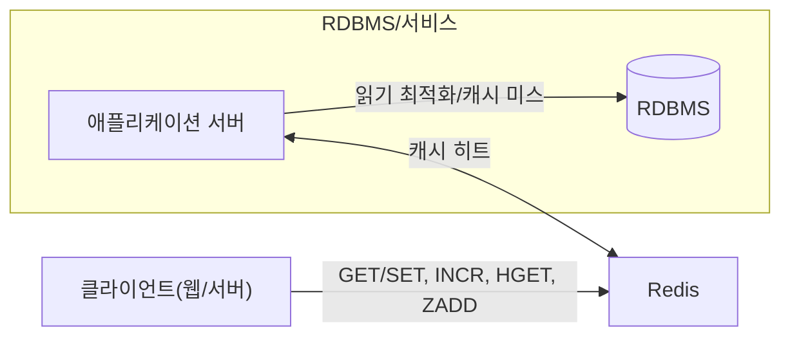

# Chapter 01 Redis 소개와 기본 개념

## 01-1 Redis란 무엇인가

### 개요
Redis는 인메모리(In-memory) 기반의 Key-Value 데이터 스토어로, 매우 낮은 지연(latency)과 높은 처리량(throughput)을 제공하는 오픈 소스 데이터 시스템입니다. 단순한 키-값 저장소를 넘어서 다양한 자료구조(String, List, Set, Sorted Set, Hash, Bitmap, HyperLogLog, Geo, Stream)를 제공하며, 캐시, 세션 저장소, 랭킹, 메시징(Pub/Sub) 등 웹 애플리케이션의 성능과 확장성 향상에 널리 활용됩니다. 이 절에서는 Redis의 정체성과 핵심 특징, 그리고 언제 사용하기 좋은지에 대해 알아봅니다.

### 인메모리 데이터 스토어와 Key-Value 모델
- 인메모리: 대부분의 데이터를 메모리(RAM)에 저장하여 디스크 I/O를 최소화하고 초저지연 응답을 제공합니다.
- Key-Value: 키로 데이터를 식별하고 값(value)에 다양한 자료구조를 저장합니다. 간단한 API로 빠른 읽기/쓰기 작업을 수행할 수 있습니다.
- 퍼시스턴스 선택: RDB 스냅샷, AOF(Append Only File), 혼합 모드 등으로 메모리 데이터를 디스크에 내구성 있게 유지할 수 있습니다.

### Redis의 핵심 특징
1. 단일 스레드 이벤트 루프
   - I/O 멀티플렉싱 기반의 이벤트 루프로 동시성을 처리합니다.
   - 단일 스레드 특성 덕분에 락 경합이 적고, 예측 가능한 성능을 보입니다.
2. 높은 성능과 낮은 지연
   - 메모리 기반 + 효율적인 자료구조 구현으로 마이크로초~밀리초 단위 응답을 제공합니다.
   - 파이프라이닝으로 네트워크 왕복(RTT)을 줄일 수 있습니다.
3. 단순하고 풍부한 자료구조
   - String, Hash, List, Set, Sorted Set 외에도 Bitmap, HyperLogLog, Geo, Stream 등 고급 기능을 포함합니다.
4. 내장 메시징과 유연한 확장
   - Pub/Sub과 Stream을 통한 메시징/이벤트 처리 지원.
   - 복제, Sentinel, Cluster를 통한 고가용성/수평 확장.

### 언제 Redis를 쓰면 좋은가
- 캐시(Cache): 데이터베이스 쿼리 결과나 API 응답 캐싱으로 응답 속도 향상과 부하 감소.
- 세션 저장소(Session Store): 사용자 세션/토큰/임시 상태를 빠르게 저장 및 조회.
- 랭킹/리더보드(Ranking): Sorted Set으로 점수 기반 정렬과 범위 조회에 최적.
- 카운팅/레이트 리미팅(Counting/Rate Limiting): INCR, EXPIRE 조합으로 간단한 제한 구현.
- Pub/Sub 및 Stream: 실시간 알림, 이벤트 스트리밍, 비동기 처리 파이프라인.
- 지리정보(Geo): 반경 검색 등 위치 기반 기능.

### 3가지 키워드로 정리하는 핵심 포인트
1. 인메모리: 초저지연, 높은 처리량으로 웹 애플리케이션의 성능 병목을 완화합니다.
2. 자료구조: 다양한 자료구조를 이용해 문제 유형에 맞는 최적 해법을 제공합니다.
3. 단순성: 간단한 명령과 단일 스레드 모델로 운영과 개발 복잡도를 낮춥니다.

### 확인 문제
1. Redis를 가장 정확히 설명하는 문장은 무엇인가?
    - [ ] 디스크 기반 관계형 데이터베이스로 SQL을 사용한다.
    - [ ] 인메모리 기반의 Key-Value 데이터 스토어로 다양한 자료구조를 제공한다.
    - [ ] 파일 시스템 캐시만을 제공하는 라이브러리다.
    - [ ] 브라우저 내 로컬 스토리지의 대체 기술이다.

2. 다음 중 Redis의 핵심 특징으로 보기 어려운 것은?
    - [ ] 단일 스레드 이벤트 루프 기반 동시성 모델
    - [ ] 초저지연 응답과 높은 처리량
    - [ ] 다양한 고수준 자료구조 제공
    - [ ] 모든 연산이 트랜잭션 로그를 통해 ACID를 완벽 보장

3. [복수 응답] Redis를 사용하기 좋은 시나리오를 모두 고르세요.
    - [ ] 세션 저장소로 사용자 세션을 빠르게 조회/저장
    - [ ] 랭킹/리더보드 구현
    - [ ] 대규모 조인(Join) 연산 중심의 데이터 분석
    - [ ] API 응답 캐싱을 통한 성능 개선
    - [ ] 실시간 알림/메시징 처리

> [정답 및 해설 보기](../answers_and_explanations.md#01-1-redis란-무엇인가)
