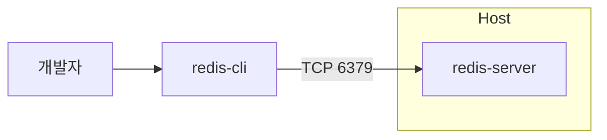

# Chapter 01 Redis 소개와 기본 개념

## 01-2 설치와 기본 사용법

### 개요
이 절에서는 macOS, Linux, Docker 환경에서 Redis를 설치하고, 로컬에서 서버를 구동한 뒤 redis-cli로 접속하여 기본 명령어(PING, GET/SET/DEL/EXISTS, KEYS/SCAN)를 실행하는 방법을 학습합니다. 또한 안전하게 테스트하는 요령과 자주 겪는 문제 해결 팁을 제공합니다.

### 설치 방법 (macOS, Linux, Docker)

#### macOS (Homebrew)
```bash
# 설치
brew install redis
# 실행 (포그라운드)
redis-server
# 백그라운드 서비스로 실행/중지
brew services start redis
brew services stop redis
```

#### Ubuntu/Debian (APT)
```bash
sudo apt update
sudo apt install redis-server -y
# 서비스 상태 확인
sudo systemctl status redis-server
# 시작/중지/재시작
sudo systemctl start redis-server
sudo systemctl stop redis-server
sudo systemctl restart redis-server
```

#### RHEL/CentOS (Yum/DNF) 또는 바이너리
```bash
# EPEL 등 저장소 설정 후 설치 예시 (배포판에 따라 상이)
sudo dnf install redis -y
sudo systemctl enable --now redis
```

#### Docker
```bash
# 최신 Redis 이미지를 받아 포트 6379 노출하여 실행
docker run -it --rm -p 6379:6379 --name redis redis:latest
# 비밀번호 설정 예시 (--requirepass)
docker run -it --rm -p 6379:6379 --name redis \
  redis:latest redis-server --requirepass "mypassword"
```

> 팁: 로컬 개발에서 Docker를 쓰면 손쉽게 버전을 바꾸거나 깨끗한 상태로 재실행할 수 있습니다.



### redis-server / redis-cli 기본 사용

#### 서버 실행
- 기본 포트: 6379
- 설정 파일로 실행: `redis-server /path/to/redis.conf`
- 주요 설정 예: `bind 127.0.0.1`, `requirepass <password>`, `appendonly yes`

#### 클라이언트 접속
```bash
# 로컬 기본 DB(0)에 접속
redis-cli
# 원격 또는 지정 포트
redis-cli -h 127.0.0.1 -p 6379
# 비밀번호가 있을 경우
redis-cli -a mypassword
```

- 연결 확인: `PING` → 응답: `PONG`
- 데이터베이스 선택: `SELECT 0` (기본 0~15; 배포판/설정에 따라 다를 수 있음)

### 기본 명령어 빠른 실습
```text
# 연결 확인
echo:> PING
< PONG

# 값 쓰기/읽기
echo:> SET user:1:name "Alice"
< OK
echo:> GET user:1:name
< "Alice"

# 존재 여부 확인
echo:> EXISTS user:1:name
< (integer) 1

# 삭제
echo:> DEL user:1:name
< (integer) 1

echo:> EXISTS user:1:name
< (integer) 0
```

#### 여러 키를 다룰 때 주의 (KEYS vs SCAN)
- `KEYS <pattern>`: 전체 키스페이스를 블로킹 스캔합니다. 운영 환경에서는 위험(성능 저하)할 수 있습니다.
- `SCAN <cursor> [MATCH pattern] [COUNT n]`: 점진적, 논블로킹 스캔으로 운영 환경 권장.

```text
# 위험: 모든 키 나열 (개발/디버깅에만)
KEYS user:* 

# 권장: SCAN으로 점진적으로 조회
SCAN 0 MATCH user:* COUNT 100
```

#### 그 외 유용한 명령
- 만료 지정: `SET key value EX 60` (60초 만료) 또는 `EXPIRE key 60`
- 여러 키: `MSET k1 v1 k2 v2`, `MGET k1 k2`
- 데이터 삭제 주의: `FLUSHDB`(현재 DB 삭제), `FLUSHALL`(모든 DB 삭제) — 개발 환경에서만 사용 권장

### 자주 겪는 문제와 해결
- 연결 실패: 포트(6379) 오픈 여부 확인, `bind` 설정이 127.0.0.1로 제한되어 원격 접속이 막히지 않았는지 확인.
- 인증 실패: `-a <password>` 혹은 AUTH 명령으로 인증.
- 퍼시스턴스 필요: `appendonly yes`로 AOF 활성화, 또는 RDB 스냅샷 주기 조정(`save` 옵션).

### 5가지 키워드로 정리하는 핵심 포인트
1. 설치(Install): macOS, Linux, Docker 중 편한 방법으로 손쉽게 시작할 수 있습니다.
2. 서버/클라이언트(Server/CLI): redis-server로 구동하고 redis-cli로 상호작용합니다.
3. 기본 명령(Core Ops): PING, SET/GET, EXISTS, DEL은 가장 자주 쓰는 기본기입니다.
4. 안전한 조회(Scan): 운영에서는 KEYS 대신 SCAN을 사용해 점진적으로 탐색합니다.
5. 설정(Config): 보안(requirepass), 네트워크(bind), 내구성(appendonly/RDB)을 이해합니다.

### 확인 문제
1. TTL/만료에 대한 설명으로 가장 알맞은 것은?
    - [ ] EXPIRE key 60은 밀리초 단위 TTL을 설정한다.
    - [ ] TTL은 클라이언트 시계를 기준으로 계산된다.
    - [ ] SET key value EX 60은 값 설정과 동시에 60초 TTL을 설정한다.
    - [ ] TTL -2는 TTL이 무한대임을 의미한다.

2. 운영 환경에서 많은 키를 조회해야 할 때 권장되는 방법은?
    - [ ] KEYS user:*
    - [ ] RANDOMKEY
    - [ ] SCAN 0 MATCH user:* COUNT 100
    - [ ] DBSIZE

3. [복수 응답] 다음 중 기본 사용법과 관련하여 옳은 것을 모두 고르세요.
    - [ ] PING 명령은 연결 상태를 확인하며 일반적으로 PONG을 반환한다.
    - [ ] SET key value EX 60은 key에 60초 만료 시간을 설정한다.
    - [ ] 운영 환경에서도 KEYS는 항상 안전하며 권장된다.
    - [ ] redis-cli -a <password>로 인증이 필요한 서버에 접속할 수 있다.
    - [ ] FLUSHALL은 현재 선택된 DB만 삭제한다.

> [정답 및 해설 보기](../answers_and_explanations.md#01-2-설치와-기본-사용법)
