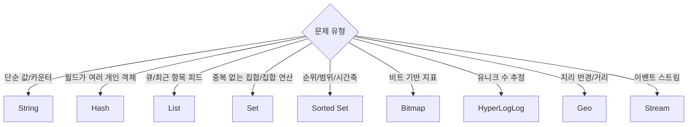

# Chapter 01 Redis 소개와 기본 개념

## 01-3 데이터 타입 개요

### 개요
이 절에서는 Redis가 제공하는 핵심 데이터 타입과 확장 타입을 한눈에 정리합니다. 각 타입의 특징, 대표 명령어, 기본 시간복잡도 경향, 그리고 웹 애플리케이션에서의 사용 시나리오를 간단한 예와 함께 살펴봅니다. 이 내용을 통해 “어떤 문제에 어떤 타입을 써야 할지”를 빠르게 판단할 수 있습니다.

### 기본 데이터 타입

#### String
- 가장 기본이 되는 바이너리 세이프(Binary-safe) 값. 숫자, 텍스트, 직렬화된 JSON 등 무엇이든 저장 가능.
- 대표 명령어: `SET`, `GET`, `MSET`, `INCR`, `DECR`, `APPEND`, `GETRANGE`, `SETEX`(EX 옵션).
- 사용 예: 캐시(토큰/세션 토큰/간단 카운터), 구성 값, 플래그.
- 시간복잡도 경향: `GET/SET` O(1), `INCR/DECR` O(1), 일부 범위 연산은 O(n).

```text
SET page:home "<html>...>"
GET page:home
INCR metrics:signup:count
SET user:1:profile "{\"name\":\"Alice\"}" EX 60
```

#### Hash
- 필드-값(field-value) 쌍의 집합. 객체(프로필, 설정) 모델링에 적합.
- 대표 명령어: `HSET`, `HGET`, `HMGET`, `HGETALL`, `HDEL`, `HINCRBY`, `HEXISTS`.
- 사용 예: 사용자 프로필, 설정 맵, 희소(Sparse) 데이터 저장.
- 시간복잡도 경향: 단일 필드 접근 O(1) 평균, `HGETALL`은 필드 수에 비례.

```text
HSET user:1 name Alice age 30
HGET user:1 name
HINCRBY user:1 points 10
```

#### List
- 양끝 삽입/삭제가 빠른 연결 리스트. 큐/스택, 작업 대기열에 적합.
- 대표 명령어: `LPUSH`, `RPUSH`, `LPOP`, `RPOP`, `LRANGE`, `BLPOP/BRPOP`(블로킹).
- 사용 예: 작업 큐, 최근 항목 피드, 로그 버퍼.
- 시간복잡도 경향: 양끝 삽입/삭제 O(1), `LRANGE`는 길이에 비례.

```text
LPUSH queue:email send:1001
RPUSH queue:email send:1002
BLPOP queue:email 0
```

#### Set
- 중복 없는 집합. 빠른 포함 여부 검사와 집합 연산 지원.
- 대표 명령어: `SADD`, `SREM`, `SISMEMBER`, `SMEMBERS`, `SUNION`, `SINTER`, `SDIFF`.
- 사용 예: 태그, 팔로워 집합, 권한 집합, 추천 교집합/합집합 연산.
- 시간복잡도 경향: 단일 원소 연산 O(1), 집합 연산은 원소 수에 비례.

```text
SADD tag:post:42 redis cache database
SISMEMBER tag:post:42 redis
SUNION tag:post:42 tag:post:7
```

#### Sorted Set (ZSet)
- 점수(score, 부동소수)로 정렬되는 집합. 순위/범위 조회에 최적.
- 대표 명령어: `ZADD`, `ZREM`, `ZSCORE`, `ZRANGE`, `ZREVRANGE`, `ZCARD`, `ZCOUNT`, `ZRANGEBYSCORE`.
- 사용 예: 리더보드, 우선순위 큐, 타임라인(타임스탬프를 스코어로).
- 시간복잡도 경향: 삽입/삭제/점수조회 O(log N), 범위 조회는 결과 크기에 비례.

```text
ZADD leaderboard 1500 user:1 1800 user:2 1750 user:3
ZRANGE leaderboard 0 2 WITHSCORES
ZREVRANGE leaderboard 0 0 WITHSCORES
```

### 확장 데이터 타입

#### Bitmap
- String을 비트 배열로 해석하여 비트 단위 조작.
- 대표 명령어: `SETBIT`, `GETBIT`, `BITCOUNT`, `BITOP`.
- 사용 예: 출석 체크, feature 플래그 비트맵, 일간 활성 사용자 추적.
- 특징: 매우 메모리 효율적인 boolean 집합 카운팅.

```text
SETBIT online:2025-08-29 1001 1
GETBIT online:2025-08-29 1001
BITCOUNT online:2025-08-29
```

#### HyperLogLog (HLL)
- 대략적(확률적) 유니크 카디널리티 추정 구조.
- 대표 명령어: `PFADD`, `PFCOUNT`, `PFMERGE`.
- 사용 예: 고유 방문자 수(UV), 고유 검색어 수 등 대규모 카운팅.
- 특징: 고정 메모리(약 12KB)로 큰 규모의 고유수 추정; 오차 허용.

```text
PFADD uv:2025-08-29 user1 user2 user3
PFCOUNT uv:2025-08-29
```

#### Geospatial (Geo)
- 경도/위도 좌표 기반의 지리 연산.
- 대표 명령어: `GEOADD`, `GEODIST`, `GEORADIUS`(신규 버전에서는 `GEOSEARCH` 권장), `GEOHASH`.
- 사용 예: 주변 매장 찾기, 반경 내 사용자 검색, 배달 반경 계산.

```text
GEOADD stores 126.9780 37.5665 seoul 139.6917 35.6895 tokyo
GEOSEARCH stores FROMLONLAT 126.98 37.57 BYRADIUS 50 km WITHDIST
```

#### Stream
- 로그/이벤트 스트림 데이터 구조. 소비자 그룹 기반 처리 가능.
- 대표 명령어: `XADD`, `XREAD`, `XGROUP CREATE`, `XREADGROUP`, `XACK`.
- 사용 예: 이벤트 소싱, 비동기 파이프라인, 작업 처리.
- 특징: 메시지 보관과 재처리를 위한 ID 기반 읽기 모델.

```text
XADD orders * user 1 item "book" price 20
XGROUP CREATE orders g1 $ MKSTREAM
XREADGROUP GROUP g1 c1 COUNT 1 STREAMS orders >
XACK orders g1 169329083-0
```

### 언제 어떤 타입을 선택할까?


### 5가지 키워드로 정리하는 핵심 포인트
1. 적합성(Fit): 문제 유형에 맞춰 타입을 선택하면 단순하고 빠른 해법을 얻습니다.
2. 성능(Performance): O(1)/O(log N) 등 연산 복잡도를 고려해 설계합니다.
3. 메모리(Memory): Bitmap/HLL 등은 큰 규모를 메모리 효율적으로 다룹니다.
4. 모델링(Modeling): Hash/Set/ZSet으로 도메인 모델을 자연스럽게 표현합니다.
5. 운영성(Operability): 범위 조회, 만료, 스캔(SSCAN/ZSCAN/HSCAN) 등을 함께 고려합니다.

### 확인 문제
1. Sorted Set(ZSet)을 사용하는 것이 가장 적절한 시나리오는 무엇인가?
    - [ ] 사용자 프로필의 필드-값 저장
    - [ ] 단순 키-값 캐시
    - [ ] 순위 기반 리더보드 구현
    - [ ] 중복 없는 태그 모음 관리

2. 다음 중 HyperLogLog(HLL)에 대한 설명으로 옳지 않은 것은?
    - [ ] 고유 원소 수를 근사(추정)한다.
    - [ ] 매우 적은 고정 메모리로 큰 규모를 다룰 수 있다.
    - [ ] 각 원소를 정확히 저장하여 이후 개별 삭제가 가능하다.
    - [ ] 유니크 방문자 수(UV) 추정에 활용할 수 있다.

3. [복수 응답] 다음 중 집합(Set) 또는 정렬된 집합(ZSet)의 적절한 활용으로 옳은 것을 모두 고르세요.
    - [ ] 공통 관심사 사용자를 구하기 위해 두 집합의 교집합을 구한다.
    - [ ] 타임스탬프를 점수로 하여 최근 게시물을 범위 조회한다.
    - [ ] 사용자 객체의 세부 필드(name, age)를 저장한다.
    - [ ] 주변 5km 내 매장을 반경 검색한다.
    - [ ] 특정 날짜의 활성 사용자 여부를 비트로 기록한다.

> [정답 및 해설 보기](../answers_and_explanations.md#01-3-데이터-타입-개요)
