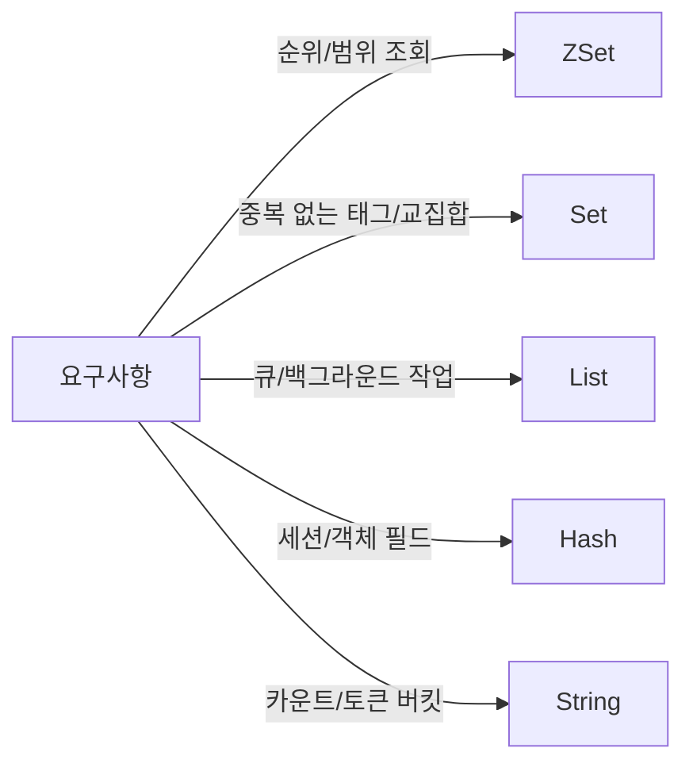

# Chapter 02 데이터 구조와 핵심 동작 원리

## 02-1 자료구조 심화와 사용 시나리오

### 개요
이 절에서는 Redis 자료구조의 내부 인코딩과 대표 연산의 시간복잡도, 그리고 실제 웹/백엔드 시나리오에서의 설계 방법을 다룹니다. 또한 MSET/MGET, HSCAN/SSCAN/ZSCAN, ZINTER/ZUNION 같은 심화 명령을 통해 대량 처리와 집계 패턴을 학습합니다. 목표는 “문제 유형에 가장 적합한 자료구조와 명령을 선택해 예측 가능한 성능을 얻는 것”입니다.

### 자료구조와 인코딩, 시간복잡도
- String
  - 내부: SDS(Simple Dynamic String). 숫자 증가/감소(INCR/DECR)도 String에 수행.
  - 대표 연산: GET/SET O(1), INCR/DECR O(1), GETRANGE/SETRANGE O(n).
- Hash
  - 내부: ziplist/ziplist 후속(최신은 listpack) ↔ hashtable. 필드 수/필드 길이가 임계치를 넘으면 해시 테이블로 변경.
  - 대표 연산: HSET/HGET 평균 O(1), HGETALL/HSCAN은 항목 수에 비례.
- List
  - 내부: quicklist(연결 리스트 + 압축 블록). 양끝 삽입/삭제에 최적화.
  - 대표 연산: LPUSH/RPUSH/LPOP/RPOP O(1), LRANGE O(n).
- Set
  - 내부: intset(작은 정수 전용) ↔ hashtable. 원소 수/타입에 따라 전환.
  - 대표 연산: SADD/SISMEMBER 평균 O(1), SINTER/SUNION/SDIFF는 크기에 비례.
- Sorted Set(ZSet)
  - 내부: skiplist + dict(해시). 점수 순 정렬, 멤버→점수 조회 모두 효율적으로 지원.
  - 대표 연산: ZADD/ZREM/ZRANK O(log N), ZRANGE/ZREVRANGE 결과 크기에 비례, ZINTER/ZUNION은 입력 크기 합에 비례.

> 주의: 인코딩 전환 임계(예: hash-max-ziplist-entries, list-compress-depth 등)는 버전/설정에 따라 다릅니다. 큰 객체나 긴 필드가 많아지면 인코딩이 바뀌며 메모리와 성능 특성이 달라질 수 있습니다.



### 사용 시나리오 설계 패턴

#### 1) 랭킹/리더보드 (ZSet)
- 키: `leaderboard:global`
- 삽입: `ZADD leaderboard:global 1800 user:2` (점수는 점수/레벨/가중치)
- 조회: `ZREVRANGE leaderboard:global 0 99 WITHSCORES` (Top 100)
- 구간: 최근 활동을 타임스탬프 스코어로 `ZRANGEBYSCORE`
- 주의: 대용량 업데이트 시 파이프라이닝, 배치 처리 고려.

#### 2) 태그/추천 (Set, 집합 연산)
- 사용자 관심사: `SADD interests:user:1 redis cache devops`
- 교집합으로 매칭: `SINTER interests:user:1 interests:user:2`
- 합집합/차집합으로 추천 후보 필터링: `SUNION`, `SDIFF`
- 대규모 연산은 입력 크기에 비례하므로 캐싱/사전 집계 고려.

#### 3) 큐/작업 처리 (List vs Stream)
- 간단 큐: `LPUSH queue:email job:1`; 소비자: `BRPOP queue:email 0`
- 재처리/소비자 그룹, 보관 필요: Stream 권장(`XADD`, `XGROUP`, `XREADGROUP`, `XACK`)
- 실패 재시도/가시성 타임아웃 등은 Stream이 더 유연.

#### 4) 카운팅/레이트 리미팅 (String/Bitmap)
- 카운팅: `INCR key`; 만료: `EXPIRE key 60`
- 고성능 레이트 리밋: 토큰 버킷(스크립트 또는 Lua), or 단순 window 카운트
- 활성 사용자 일간 비트: `SETBIT active:2025-08-29 <userId> 1`, `BITCOUNT active:2025-08-29`

#### 5) 세션/프로필 (Hash + TTL)
- `HSET session:<sid> uid 1001 role user`
- 만료 설정: `EXPIRE session:<sid> 1800`
- 특정 필드만 갱신/조회가 잦고, 전체 직렬화가 비효율일 때 Hash 선호.

### 명령어 심화
- MSET/MGET
  - 여러 키를 한 번에: `MSET user:1 n Alice user:2 n Bob`
  - 대량 읽기: `MGET user:1 user:2 user:3` (RTT 감소, 파이프라이닝과 병행 가능)
- HSCAN/SSCAN/ZSCAN
  - 패턴: `HSCAN user:1 0 MATCH *name* COUNT 100`
  - 대규모 컬렉션을 점진적으로 순회. 블로킹을 피하고 운영에 적합.
- 집합/정렬된 집합 집계
  - `ZINTER keyN keyM [WEIGHTS wN wM] [AGGREGATE SUM|MIN|MAX] DEST <dest>` (STORE/DEST 사용 버전에 따라)
  - 예: 여러 보정 점수를 가중 합산한 최종 점수 랭킹 계산.
  - `ZUNION`도 동일 패턴으로 합집합 집계 가능.

```text
# 예시: 두 랭킹을 가중 결합 후 상위 10명 뽑기
ZINTERSTORE lb:final 2 lb:score lb:activity WEIGHTS 0.7 0.3 AGGREGATE SUM
ZREVRANGE lb:final 0 9 WITHSCORES
```

> 팁: ZINTER/ZUNION은 입력 크기에 비례해 비용이 증가합니다. 사전 축소(필터링) 또는 작은 부분집합에만 적용하세요.

### 실무 팁
- 키 설계: 접두사로 그룹화(`type:domain:id`), 명확한 네이밍과 TTL 전략 수립.
- O(N) 연산 주의: 대형 키(한 키에 수십/수백만 원소)보다 샤딩/분할 고려.
- SCAN 계열 사용 시 MATCH/COUNT로 부하 조정, 커서 기반 반복 처리.
- 파이프라이닝으로 RTT 최소화, 단 너무 큰 파이프라인은 메모리 급증 주의.
- 인코딩 전환 임계 설정 검토로 메모리/성능 균형 맞추기.

### 5가지 키워드로 정리하는 핵심 포인트
1. 인코딩(Encoding): ziplist/listpack, intset/hashtable, skiplist 등 내부 구조를 이해하면 성능이 보입니다.
2. 복잡도(Complexity): O(1)/O(log N)/O(N)을 파악해 병목을 예측합니다.
3. 시나리오(Scenario): 랭킹, 태그, 큐, 카운팅, 세션에 맞는 구조를 선택합니다.
4. 집계(Aggregation): ZINTER/ZUNION, MGET/MSET, SCAN 계열로 대량 처리 성능을 확보합니다.
5. 운영성(Operability): 키 설계, TTL, 파이프라이닝, 대형 키 관리가 안정성을 좌우합니다.

### 확인 문제
1. ZSet의 내부 구현과 시간복잡도 설명으로 가장 알맞은 것은?
    - [ ] 해시 테이블만으로 구현되어 삽입이 O(1)이다.
    - [ ] B-Tree로 구현되어 조회가 O(log N)이고 삽입은 O(N)이다.
    - [ ] skiplist와 dict 조합으로 삽입/삭제/순위 조회가 O(log N)이다.
    - [ ] 배열로만 구현되어 범위 조회가 항상 O(1)이다.

2. 다음 중 대규모 컬렉션을 운영 환경에서 안전하게 순회하는 방법으로 가장 적절한 것은?
    - [ ] KEYS pattern
    - [ ] HGETALL/HMGET
    - [ ] HSCAN/SSCAN/ZSCAN으로 커서 기반 점진 순회
    - [ ] RANDOMKEY

3. [복수 응답] 다음 중 주어진 시나리오에 대한 자료구조/명령 선택이 적절한 것을 모두 고르세요.
    - [ ] Top 100 리더보드를 구하기 위해 ZREVRANGE leaderboard 0 99 WITHSCORES
    - [ ] 두 관심사 집합의 공통 유저를 찾기 위해 SUNION interests:a interests:b
    - [ ] 간단한 작업 큐를 블로킹 소비하려면 BRPOP queue:jobs 0
    - [ ] 일간 활성 사용자 수를 집계하려면 PFCOUNT active:2025-08-29
    - [ ] 여러 사용자 이름을 한 번에 읽기 위해 MGET user:1:name user:2:name

> [정답 및 해설 보기](../answers_and_explanations.md#02-1-자료구조-심화와-사용-시나리오)
