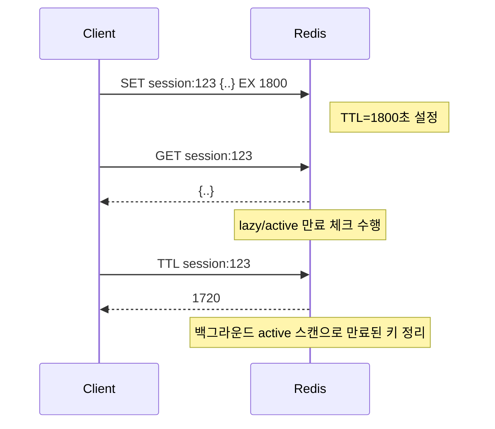
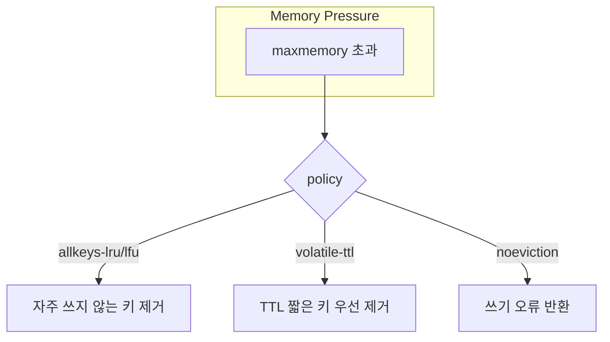

# Chapter 02 데이터 구조와 핵심 동작 원리

## 02-2 만료와 키 스페이스 관리

### 개요
이 절에서는 Redis의 만료(Expiration) 메커니즘과 TTL(Time To Live), 키스페이스 이벤트 알림(Keyspace Notifications), 그리고 메모리 관리 및 키 설계 가이드를 다룹니다. 운영 환경에서 성능과 안정성을 좌우하는 중요한 주제이며, 캐시/세션/레이트 리미팅과 같은 실제 시나리오에서 올바른 TTL 전략과 알림 설정, eviction 정책 이해가 필수입니다.

### 만료(Expiration)와 TTL의 이해
- TTL(Time To Live)은 키가 자동으로 삭제되기까지 남은 시간을 의미합니다.
- 만료는 두 방식으로 발생합니다.
  - 지연(lazy) 만료: 키 접근 시 만료 여부를 확인하고 그때 삭제.
  - 능동(active) 스캔: 백그라운드에서 주기적으로 랜덤 샘플링하여 만료된 키를 청소.
- TTL 단위
  - 초 단위: EXPIRE, TTL
  - 밀리초 단위: PEXPIRE, PTTL
- 만료 설정 방법
  - 기존 키에 부여: `EXPIRE key 60`, `PEXPIRE key 1500`
  - SET 옵션으로 동시에: `SET key value EX 60`, `SET key value PX 1500`
  - 절대 시각: `SET key value EXAT <unix-time-seconds>`, `PXAT <unix-time-millis>`
  - 기존 TTL 유지: `SET key value KEEPTTL`
- TTL 조회
  - `TTL key` (초), `PTTL key` (밀리초)
  - 반환값: 남은 시간(양수), -1(만료 없음), -2(키 없음)
- 주의사항
  - 만료 시간은 서버 시간 기준이며, 클럭 스큐에 민감할 수 있습니다.
  - RENAME/RESTORE 등 일부 명령은 만료를 이동/재설정할 수 있으니 문서를 확인하세요.



### 키스페이스 이벤트와 알림(pub/sub)
- Redis는 키 변경/만료/추가 등 이벤트를 Pub/Sub 채널로 발행할 수 있습니다.
- 채널 종류
  - 키스페이스 채널: `__keyspace@<db>__:<key>` — 해당 키에서 발생한 이벤트 타입(예: `set`, `expire`, `del`).
  - 키이벤트 채널: `__keyevent@<db>__:<event>` — 해당 이벤트 유형이 발생한 키 이름을 메시지로.
- 활성화 설정(서버 설정 또는 CONFIG)
  - `notify-keyspace-events` 옵션으로 설정.
  - 예) 만료 및 삭제, 설정/갱신, 일반 명령 이벤트 활성화: `CONFIG SET notify-keyspace-events Exg$` (예시는 조합에 따라 다름)
    - 주요 플래그: `K`(Keyspace), `E`(Keyevent), `x`(expired), `e`(evicted), `g`(generic: del/expire/rename 등), `$`(string), `A`(all events)
- 사용 예시
```text
# 설정 (예: 키이벤트+만료+삭제 활성화)
CONFIG SET notify-keyspace-events Exg

# 만료 이벤트 구독 (DB 0)
SUBSCRIBE __keyevent@0__:expired
# 또는 특정 키의 이벤트 유형 구독 (키스페이스 채널)
PSUBSCRIBE __keyspace@0__:* 
```
- 주의: 알림은 best-effort이며, 과도한 이벤트는 성능에 영향을 줄 수 있습니다. 필요한 최소 조합만 활성화하세요.

### 메모리 관리와 키 설계 가이드
- maxmemory와 eviction 정책
  - `maxmemory`: Redis 인스턴스가 사용할 최대 메모리.
  - `maxmemory-policy`: 메모리 초과 시 제거 정책.
    - allkeys-lru / volatile-lru: LRU 기반 제거 (전체 키 / TTL 있는 키만)
    - allkeys-lfu / volatile-lfu: LFU 기반 제거 (접근 빈도 기반)
    - allkeys-random / volatile-random: 무작위 제거
    - volatile-ttl: 남은 TTL이 가장 짧은 키 우선 제거
    - noeviction: 제거하지 않고 쓰기 오류 반환
  - 샘플링: `maxmemory-samples`(기본 5 등)로 후보 샘플 크기 설정. LRU/LFU 정밀도에 영향.
  - LFU 파라미터: `lfu-log-factor`, `lfu-decay-time`으로 빈도 카운트 민감도/감쇠 제어.
- TTL 전략
  - 캐시 키는 가능한 TTL을 명확히 설정. 스탬피드 방지 위해 무작위 지터(±10%) 추가.
  - 세션/토큰은 비즈니스 만료 정책과 일치시키되, 갱신 시 `EXPIRE` 재설정 또는 `SET ... KEEPTTL` 고려.
  - 중요 데이터는 TTL 없이 유지하고 별도 백업/퍼시스턴스 정책 사용.
- 키 네이밍/설계
  - 접두사 규칙: `type:domain:id[:field]` 등 일관성 유지.
  - 큰 단일 키 대신 샤딩/분할: `feed:<date>:<shard>`
  - 컬렉션 크기 상한 및 백그라운드 청소 작업 준비.



### 4가지 키워드로 정리하는 핵심 포인트
1. TTL: EX/PEX, EXAT/PXAT, KEEPTTL 등으로 유연하게 만료를 제어합니다.
2. 만료 처리: lazy + active 스캔이 함께 동작해 만료 키를 정리합니다.
3. 알림: `notify-keyspace-events`로 필요한 키스페이스/키이벤트를 최소 범위로 활성화합니다.
4. 메모리/eviction: maxmemory와 LRU/LFU/TTL 기반 정책을 이해하고 키/TTL 설계를 최적화합니다.

### 확인 문제
1. TTL/만료 관련 설명으로 옳은 것은 무엇인가?
    - [ ] TTL은 클라이언트 로컬 시계를 기준으로 계산된다.
    - [ ] PEXPIRE는 초 단위 TTL을 설정한다.
    - [ ] TTL이 -2를 반환하면 키는 존재하지만 만료가 없다.
    - [ ] SET key value EX 60은 키에 60초 만료를 동시에 설정한다.

2. 키스페이스 알림을 받기 위해 필요한 설정으로 가장 올바른 것은?
    - [ ] notify-keyspace-events는 기본값으로 모든 이벤트를 발행하므로 추가 설정이 불필요하다.
    - [ ] CONFIG SET notify-keyspace-events Exg를 사용하면 만료/삭제/일반 이벤트에 대한 키이벤트 채널 알림을 활성화할 수 있다.
    - [ ] SUBSCRIBE __keyspace@0__:expired를 실행하면 모든 DB의 만료 이벤트를 받을 수 있다.
    - [ ] 키이벤트 채널은 형식이 __keyspace@<db>__:<event> 이다.

3. [복수 응답] 다음 중 maxmemory-policy에 대한 설명으로 옳은 것을 모두 고르세요.
    - [ ] allkeys-lru는 TTL이 없는 키는 제거 대상이 아니다.
    - [ ] volatile-ttl은 남은 TTL이 짧은 키부터 제거를 시도한다.
    - [ ] noeviction은 메모리 초과 시 쓰기 명령이 오류를 반환할 수 있다.
    - [ ] allkeys-lfu는 접근 빈도가 낮은 키를 우선 제거한다.
    - [ ] volatile-random은 전체 키 중 무작위로 제거한다.

> [정답 및 해설 보기](../answers_and_explanations.md#02-2-만료와-키-스페이스-관리)
