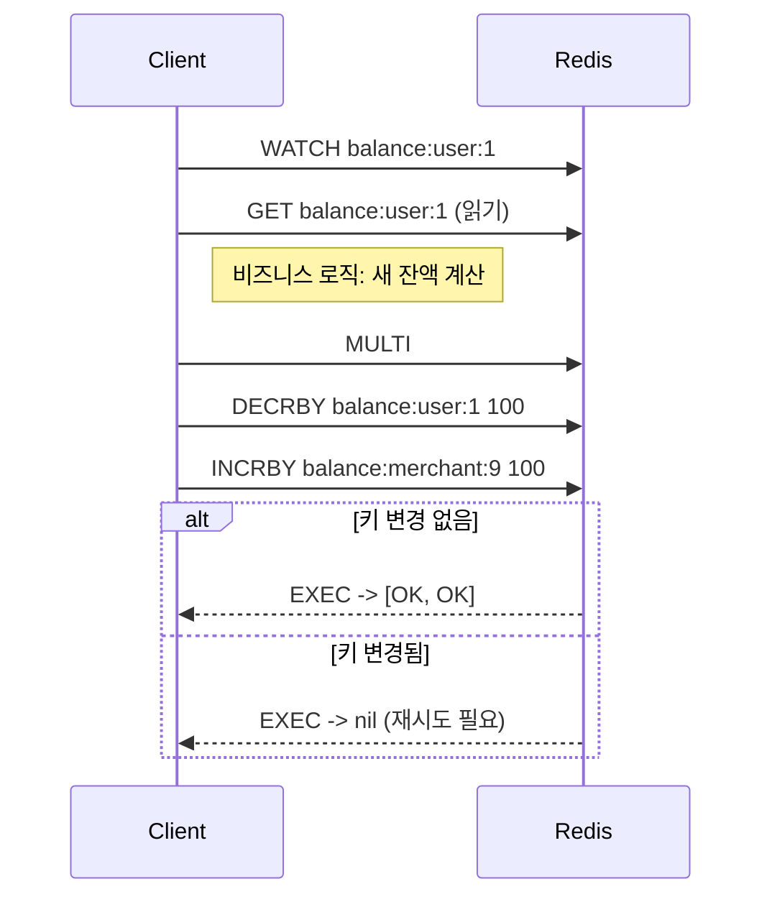

# Chapter 02 데이터 구조와 핵심 동작 원리

## 02-3 트랜잭션, Lua, 파이프라이닝

### 개요
이 절에서는 Redis에서의 트랜잭션(Transaction), Lua 스크립트, 그리고 파이프라이닝(Pipelining)의 개념과 사용법을 정리합니다. 무엇이 원자적(atomic)이며 무엇이 아닌지, 언제 어떤 기법을 선택해야 하는지, 성능과 일관성 측면에서 주의할 점은 무엇인지 실무 관점에서 설명합니다.

### 트랜잭션(MULTI/EXEC/DISCARD/WATCH)
- 기본 개념
  - Redis 트랜잭션은 `MULTI`로 시작해 명령을 큐에 쌓고, `EXEC` 시 일괄 실행합니다.
  - `DISCARD`는 큐에 쌓인 명령을 폐기합니다.
  - Redis 트랜잭션은 “명령 단위의 원자성(각 명령은 atomic)”을 제공하며, `EXEC` 시점에 큐잉된 명령들이 연속적으로 실행됩니다. 다만 RDBMS의 고립 수준(Isolation)과는 다릅니다.
- 낙관적 락(Optimistic Lock) — `WATCH`
  - `WATCH key1 [key2 ...]`로 지정한 키가 `EXEC` 전에 변경되면 트랜잭션이 중단되고 `EXEC`은 `nil`(혹은 `(nil)`/`null`)을 반환합니다.
  - 일반 패턴: `WATCH -> 읽기 -> 조건 계산 -> MULTI -> 수정 명령 큐잉 -> EXEC`. 실패 시 재시도 로직 구현.
- 에러 처리
  - 명령 큐잉 단계의 오류(타이핑 오류 등)는 `EXEC` 시 전체 트랜잭션이 실패합니다.
  - 실행 단계에서 특정 명령 실패는 그 명령에 한해 실패로 표시되며 나머지는 계속 실행됩니다(응용별 롤백 필요).
- 주의점
  - 긴 트랜잭션은 이벤트 루프 점유가 길어질 수 있고, `WATCH` 재시도율이 높아질 수 있습니다.
  - 만료 예정 키를 다룰 때는 만료 타이밍에 따라 `WATCH` 실패 가능성 증가.



#### 예시: Compare-And-Set(재시도 루프)
```text
WATCH stock:42
val = GET stock:42
if (val >= 1) {
  MULTI
  DECR stock:42
  EXEC
  # EXEC 결과가 nil이면 실패 → 재시도
} else {
  UNWATCH
  # 재고 부족 처리
}
```

### Lua 스크립팅(EVAL/EVALSHA)
- 왜 Lua인가
  - 여러 명령을 서버 측에서 하나의 스크립트로 실행함으로써 네트워크 왕복(RTT)을 제거하고, **스크립트 단위로 원자적(atomic)** 실행을 보장합니다.
- 기본 명령
  - `EVAL <script> <numkeys> key1 key2 ... arg1 arg2 ...`
  - `EVALSHA <sha1> <numkeys> ...` + `SCRIPT LOAD`로 캐시 후 재사용
  - 스크립트 내에서 키는 `KEYS[i]`, 인자 값은 `ARGV[i]`로 접근합니다.
- 베스트 프랙티스
  - 결정적(deterministic) 동작: 외부 상태(시간/랜덤)에 의존하면 재실행 시 결과가 달라질 수 있습니다. 필요한 경우 인자를 통해 전달.
  - 긴 루프/복잡 계산 지양: 이벤트 루프 점유를 최소화.
  - 키 접근은 `numkeys`와 `KEYS[]`에 명확히 전달(클러스터 호환성 관점에서도 중요).
- 예시: 재고 차감과 주문 큐에 넣기(원자적)
```lua
-- KEYS[1] = stock key, KEYS[2] = queue key
-- ARGV[1] = amount, ARGV[2] = order payload
local stock = tonumber(redis.call('GET', KEYS[1]) or '0')
local amt = tonumber(ARGV[1])
if stock >= amt then
  redis.call('DECRBY', KEYS[1], amt)
  redis.call('LPUSH', KEYS[2], ARGV[2])
  return 1
else
  return 0
end
```
호출 예:
```text
EVAL "<위 스크립트>" 2 stock:42 queue:orders 1 "{orderId:1001}"
```

- 스크립트 관리
  - `SCRIPT LOAD <script>` → SHA1 반환, `EVALSHA <sha1> ...`로 호출
  - `SCRIPT FLUSH`로 캐시 제거(신중히 사용), `SCRIPT EXISTS <sha1>`로 존재 확인

### 파이프라이닝(Pipelining)
- 개념
  - 여러 명령을 **요청-응답 왕복 없이 연속 전송**하여 네트워크 지연(RTT) 비용을 크게 줄이는 클라이언트 기술입니다.
  - 응답은 전송 순서대로 반환됩니다. 단, 파이프라이닝 자체는 **원자성**을 보장하지 않습니다(트랜잭션과 다름).
- 언제 쓰나
  - 대량 읽기/쓰기, 일괄 마이그레이션, 초기 로딩 등 RT T가 병목일 때.
- 주의점
  - 너무 큰 파이프라인은 클라이언트/서버 메모리 사용량 증가, 응답 처리 지연.
  - 실패 시 재시도 전략 필요(멱등 명령 우선, 비멱등은 신중히).
- 예시(개념 흐름)

```mermaid
gantt
  dateFormat  X
  title 파이프라이닝 vs 개별 요청의 왕복
  section 개별 요청
  요청1            :a1, 0, 3
  응답1            :after a1, 2
  요청2            :after a1, 3
  응답2            :after a1, 5
  section 파이프라인
  요청1,2,3 일괄전송 :b1, 0, 3
  응답1,2,3 일괄수신 :after b1, 3
```

- 코드 스니펫(개념, 의사 코드)
```text
# 예: 1000개 키 세팅을 파이프라인으로
client.pipeline() do |p|
  for i in 1..1000
    p.set("k:"..i, i)
  end
end
```

### 트랜잭션 vs Lua vs 파이프라이닝 — 선택 가이드
- 일관성 있는 조건부 갱신(CAS): WATCH + MULTI/EXEC(낙관적 락) 또는 Lua(원자적 서버측 실행)
- 네트워크 RTT 최소화: 파이프라이닝 또는 Lua(서버측 연산)
- 복잡한 원자적 조합 로직: Lua 스크립트 권장
- 단순 일괄 처리(원자성 불필요): 파이프라이닝 권장

### 4가지 키워드로 정리하는 핵심 포인트
1. 트랜잭션(Transaction): MULTI/EXEC + WATCH로 낙관적 락 패턴을 구현한다.
2. 원자성(Atomicity): Lua 스크립트는 스크립트 전체를 원자적으로 실행한다.
3. 성능(Performance): 파이프라이닝으로 RTT를 줄이되 메모리 사용을 주의한다.
4. 재시도(Retry): WATCH 충돌, 네트워크 오류 등 상황에서 안전한 재시도 전략을 설계한다.

### 확인 문제
1. Redis에서 `WATCH`를 사용한 트랜잭션 패턴에 대한 설명으로 가장 알맞은 것은?
    - [ ] WATCH는 EXEC 이후에만 설정할 수 있으며 트랜잭션의 원자성을 보장한다.
    - [ ] WATCH로 감시한 키가 변경되면 EXEC는 오류를 던지고 서버가 자동 롤백한다.
    - [ ] WATCH는 EXEC 전에 감시한 키 변경을 감지해 EXEC가 nil을 반환하도록 하며, 일반적으로 클라이언트에서 재시도 로직을 구현한다.
    - [ ] WATCH는 트랜잭션 동안 키의 만료를 방지하여 갱신 충돌을 없애준다.

2. Lua 스크립트 실행(EVAL)에 대한 설명으로 옳은 것은?
    - [ ] Lua 스크립트는 일부 명령만 원자적이며 나머지는 병렬 실행된다.
    - [ ] EVAL로 실행된 스크립트는 전체가 원자적으로 실행되며, 스크립트 내부에서 여러 명령을 호출할 수 있다.
    - [ ] EVAL은 네트워크 왕복을 늘리는 대신 서버 부하를 줄이는 방법이다.
    - [ ] KEYS와 ARGV는 같은 배열로 전달되어 구분이 없다.

3. [복수 응답] 파이프라이닝에 대한 설명으로 옳은 것을 모두 고르세요.
    - [ ] 파이프라이닝은 네트워크 왕복(RTT)을 줄여 처리량을 높일 수 있다.
    - [ ] 파이프라이닝은 트랜잭션과 동일하게 명령들의 원자성을 보장한다.
    - [ ] 너무 큰 파이프라인은 메모리 사용량과 지연을 증가시킬 수 있다.
    - [ ] 파이프라이닝은 응답을 순서대로 받지만 중간에 오류가 섞일 수 있으므로 클라이언트에서 결과를 해석해야 한다.
    - [ ] 파이프라이닝은 항상 Lua보다 빠르다.

> [정답 및 해설 보기](../answers_and_explanations.md#02-3-트랜잭션-lua-파이프라이닝)
