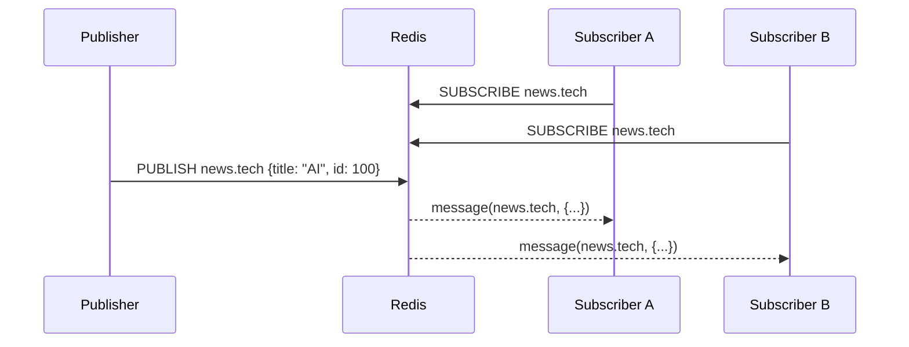
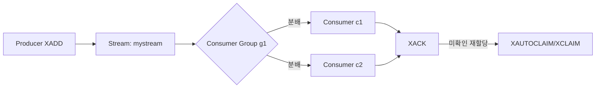

# Chapter 02 데이터 구조와 핵심 동작 원리

## 02-4 메시징: Pub/Sub과 Stream

### 개요
이 절에서는 Redis의 두 가지 메시징 기능인 Pub/Sub과 Streams를 비교해가며 소개합니다. Pub/Sub은 휘발성 실시간 브로드캐스트에, Streams는 내구성과 재처리가 필요한 이벤트 로그/큐에 적합합니다. 각 기능의 명령어, 전달 보장, 백프레셔 전략, 운영 시 주의점을 실용 관점에서 정리합니다.

### Pub/Sub 기초(PUBLISH/SUBSCRIBE/PSUBSCRIBE)
- 개념
  - 발행자(Publisher)가 채널에 메시지를 `PUBLISH`하면 해당 채널을 구독(`SUBSCRIBE`) 중인 모든 구독자에게 즉시 전달됩니다.
  - 패턴 구독(`PSUBSCRIBE news.*`)으로 와일드카드 매칭이 가능합니다.
- 핵심 특성
  - 휘발성: 구독하지 않는 동안의 메시지는 저장되지 않습니다(오프라인 소비 불가).
  - 브로드캐스트: 같은 채널을 듣는 모든 구독자가 동일 메시지를 받습니다.
  - 단순성/저지연: 매우 낮은 지연으로 실시간 알림/신호 전달에 적합.
- 기본 명령
  - `SUBSCRIBE channel1 [channel2 ...]`
  - `PSUBSCRIBE pattern1 [pattern2 ...]`
  - `PUBLISH channel payload`
  - `UNSUBSCRIBE [channel ...]`, `PUNSUBSCRIBE [pattern ...]`
- 사용 예(클라이언트 간 단순 알림)
```text
# 터미널 A
redis-cli SUBSCRIBE notif:system
# 터미널 B
redis-cli PUBLISH notif:system "deployed v1.2.3"
```
- 장단점 요약
  - 장점: 구현 간단, 실시간 브로드캐스트에 최적.
  - 한계: 저장/재전송/확인(ack)/리플레이/소비자 그룹이 없습니다. 내구성이 필요한 큐에는 부적합.



### Redis Streams 개요(XADD/XREAD/XGROUP/XACK)
- 개념
  - 로그처럼 append-only 레코드 스트림을 관리합니다. 각 엔트리는 ID(예: 1717000000000-0)를 갖고, 소비자는 ID 기준으로 읽습니다.
  - **소비자 그룹(Consumer Group)**으로 수평 확장이 가능하며, 각 메시지는 그룹 내 한 소비자에게 분배됩니다.
- 핵심 특성
  - 내구성: 메시지가 키에 저장되어 오프라인 이후에도 재처리/리플레이 가능.
  - 확인/재시도: `XACK`으로 처리 확인, 미확인 메시지는 PEL(Pending Entries List)에 남습니다. `XCLAIM`/`XAUTOCLAIM`으로 다시 가져오기 가능.
  - 백프레셔: 생산/소비 속도 차이를 버퍼로 흡수하되, 길이 제한/트리밍 필요.
- 기본 명령 흐름
  - 생산: `XADD mystream * field1 value1 [MAXLEN ~ 100000]`
  - 소비(단독): `XREAD BLOCK 5000 STREAMS mystream $` 또는 `0-0`
  - 그룹 생성: `XGROUP CREATE mystream mygroup $ MKSTREAM`
  - 그룹 소비: `XREADGROUP GROUP mygroup c1 BLOCK 5000 STREAMS mystream >`
  - 처리 확인: `XACK mystream mygroup <id ...>`
  - 보류 메시지 조회: `XPENDING mystream mygroup [start end count [consumer]]`
  - 재할당: `XCLAIM`/`XAUTOCLAIM`으로 타임아웃 초과 메시지 소유권 이전
- 최소 예시
```text
# 스트림 생성 및 메시지 적재
XADD mystream * type order id 1001
# 소비자 그룹 생성(스트림 없으면 MKSTREAM)
XGROUP CREATE mystream g1 $ MKSTREAM
# 소비자 c1이 신규 메시지 소비
XREADGROUP GROUP g1 c1 COUNT 10 BLOCK 0 STREAMS mystream >
# 처리 완료 후 ack
XACK mystream g1 <받은-id>
```



#### 전달 보장과 의미 체계
- Pub/Sub: at-most-once에 가까움(오프라인/네트워크 이슈 시 상실). 재전송/ack 없음.
- Streams + 그룹: at-least-once(기본). 중복 가능성이 있으므로 소비자 로직은 멱등해야 함. 정확히-한번은 애플리케이션 설계/스토리지로 보완.

#### 백프레셔와 용량 관리
- `MAXLEN` 또는 `MINID`로 트리밍: `XADD mystream MAXLEN ~ 1_000_000 * ...`
- 소비 지연 모니터링: `XPENDING`, `XINFO CONSUMERS/GROUPS`, `XLEN`으로 적체 파악.
- 느린 소비자 처리: 재시도/재할당(XAUTOCLAIM), 느린 컨슈머 격리, 배치 크기/동시성 조절.

### 실무 패턴과 베스트 프랙티스
- 패턴
  - Pub/Sub로 “신호”를 보내고, 상세 데이터는 캐시/DB에서 조회(경량화).
  - Streams로 이벤트 소싱/비동기 처리 파이프라인 구현: 생성→소비→ack→재시도/사망 큐(DLQ) 설계.
- 멱등성
  - 이벤트 ID 또는 비즈니스 키로 중복 처리 방지(예: SETNX, Lua, DB unique key).
- DLQ(사망 큐)
  - 재시도 한도를 넘긴 메시지는 별도 스트림으로 이동: `XADD dlq:*` + 메타데이터(에러 코드, 재시도 수).
- 운영 체크리스트
  - Stream 키의 `MAXLEN ~`으로 무한 성장 방지.
  - 소비자 그룹별 누적 PEL 모니터링 및 재할당 작업 배치.
  - 긴 Lua/블로킹 명령의 혼잡으로 전체 레이턴시 악화되지 않도록 주의.

### Java/Node.js 간단 예시
- Java (Lettuce 예시, 개념 코드)
```java
// Lettuce
RedisClient client = RedisClient.create("redis://localhost:6379");
StatefulRedisConnection<String, String> conn = client.connect();
RedisCommands<String, String> cmd = conn.sync();
// Stream 생산
String id = cmd.xadd("mystream", Map.of("type","order","id","1001"));
// 그룹 생성(최초 1회)
try { cmd.xgroupCreate( XReadArgs.StreamOffset.from("mystream", "$"), "g1"); } catch (Exception ignore) {}
// 그룹 소비
List<StreamMessage<String, String>> msgs = cmd.xreadgroup(Consumer.from("g1","c1"), XReadArgs.StreamOffset.lastConsumed("mystream"));
for (var m : msgs) { /* 처리 */ cmd.xack("mystream","g1", m.getId()); }
```
- Node.js (ioredis Pub/Sub)
```js
const Redis = require('ioredis');
const sub = new Redis();
const pub = new Redis();
sub.subscribe('notif:system');
sub.on('message', (ch, msg) => console.log(ch, msg));
pub.publish('notif:system', 'deployed v1.2.3');
```

### 4가지 키워드로 정리하는 핵심 포인트
1. 선택(Choose): Pub/Sub은 실시간 브로드캐스트, Streams는 내구성/재처리가 필요한 워크로드에. 
2. 전달(Delivery): Pub/Sub은 휘발성, Streams는 at-least-once + ack/PEL.
3. 확장(Scale): Streams의 소비자 그룹으로 수평 확장, 백프레셔는 트리밍/재할당/모니터링으로 관리.
4. 멱등(Idempotency): 중복 가능성을 전제로 안전한 재처리 로직을 설계.

### 확인 문제
1. Pub/Sub에 대한 설명으로 가장 알맞은 것은?
    - [ ] 메시지는 오프라인 기간 동안 저장되며 나중에 리플레이할 수 있다.
    - [ ] 각 메시지는 소비자 그룹 내 한 명에게만 전달된다.
    - [ ] 브로드캐스트 기반으로 구독 중인 모든 구독자에게 전달되며 저장/ack이 없다.
    - [ ] 정확히-한번(exactly-once) 처리를 보장한다.

2. Streams 소비자 그룹에 대한 설명으로 옳은 것은?
    - [ ] 그룹 내 모든 소비자가 같은 메시지를 중복 수신한다.
    - [ ] ack를 하지 않아도 메시지는 자동으로 처리 완료로 간주된다.
    - [ ] 미확인 메시지는 PEL에 남으며 XCLAIM/XAUTOCLAIM으로 재할당할 수 있다.
    - [ ] 그룹을 쓰면 at-most-once가 보장된다.

3. [복수 응답] Streams 운영과 백프레셔 관리에 대한 모범 사례를 모두 고르세요.
    - [ ] XADD 시 MAXLEN ~ 옵션을 활용해 스트림 크기를 제한한다.
    - [ ] XPENDING/XINFO로 적체와 느린 소비자를 모니터링한다.
    - [ ] 재시도 한도를 넘긴 메시지는 DLQ로 이동시켜 별도 처리한다.
    - [ ] 정확히-한번을 기본으로 제공하므로 멱등성은 고려하지 않아도 된다.
    - [ ] 소비 속도가 느리면 XAUTOCLAIM으로 장기 보류 메시지를 재할당한다.

> [정답 및 해설 보기](../answers_and_explanations.md#02-4-메시징-pubsub과-stream)
