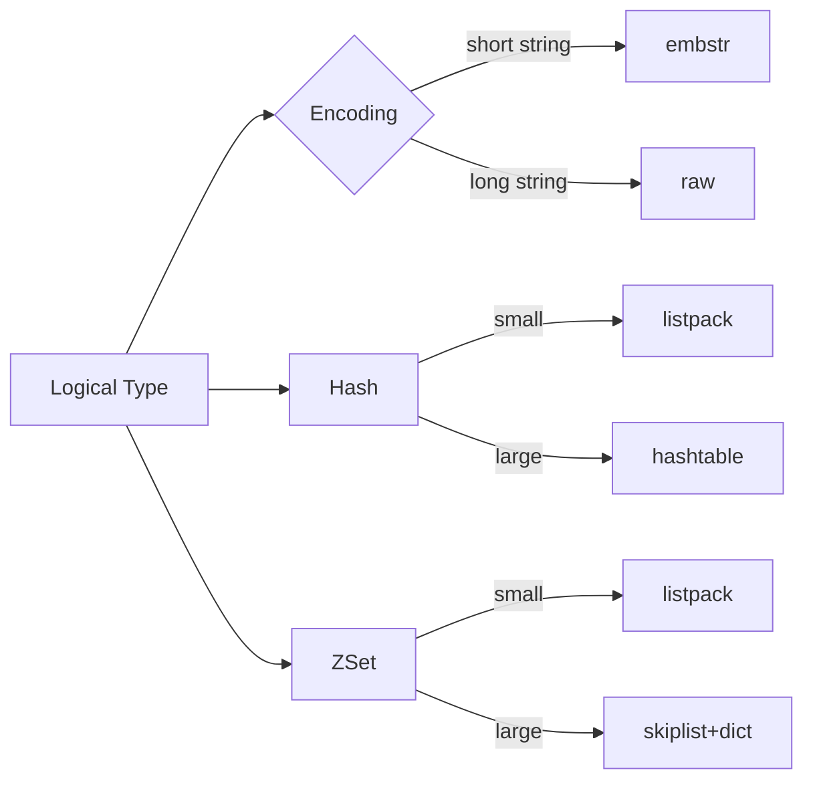
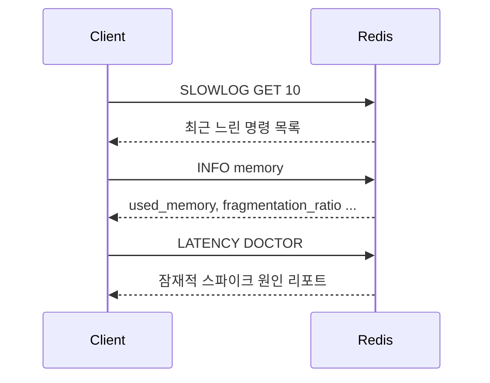

# Chapter 03 운영 관점의 Redis

## 03-1 메모리와 성능

### 개요
이 절에서는 Redis의 메모리 모델과 객체 인코딩, 메모리 압력 하에서의 제거(eviction) 정책, 그리고 성능 측정/모니터링 방법을 다룹니다. 또한 lazy-free, active defrag 같은 운영 옵션과 Java/Javascript(노드) 관점의 실무 팁을 정리합니다.

### 메모리 모델과 오브젝트 인코딩
- Redis 객체
  - Redis는 내부적으로 타입과 인코딩을 가진 객체로 값을 관리합니다. 동일한 논리 타입이라도 저장 크기/운영 특성에 따라 다른 인코딩을 사용합니다.
  - 예: String → embstr/raw, List → quicklist(listpack 기반), Hash/Set/ZSet → small size에서는 listpack(구 ziplist), 커지면 해시 테이블/스킵리스트 등으로 승격.
- String 인코딩
  - embstr: 44바이트 이하의 짧은 문자열에 최적화. 객체 헤더와 SDS(Simple Dynamic String)를 한 덩어리로 할당하여 캐시 친화적.
  - raw: 더 긴 문자열. 별도 버퍼로 관리되어 증가/감소에 유연.
- 복합 컬렉션 인코딩
  - Hash: 작은 항목 수/짧은 필드일 때 listpack, 임계치를 넘으면 hashtable로 전환.
  - Set: 작은 경우 intset(정수 전용) 또는 listpack; 커지면 hashtable.
  - ZSet: 작은 경우 listpack, 커지면 skiplist + dict 조합(빠른 순위/범위 연산).
  - List: quicklist 노드가 listpack을 담는 하이브리드 구조 → 메모리 효율과 연산 성능 균형.
- 공유 객체(Shared Integers 등)
  - 자주 쓰는 작은 정수 문자열은 공유하여 메모리 절약.
- lazy-free(비동기 해제)
  - 큰 키 삭제/만료 시 메인 스레드를 오래 붙잡지 않도록 백그라운드로 메모리 free를 오프로드(`lazyfree-lazy-eviction`, `lazyfree-lazy-expire`, `lazyfree-lazy-server-del`).
- Active defragmentation(조각 모음)
  - jemalloc 등 할당기 단편화를 줄이기 위해 `activedefrag yes`로 활성화. CPU 사용 증가와의 트레이드오프 존재.

### maxmemory와 Eviction 정책
- maxmemory
  - 인스턴스가 사용할 수 있는 최대 메모리를 지정. 초과 시 정책에 따라 제거 또는 쓰기 거부.
  - 설정: `CONFIG SET maxmemory <bytes>` 또는 redis.conf.
- 정책 종류(`maxmemory-policy`)
  - noeviction: 쓰기 명령 시 OOM 오류. 캐시보다는 정확성 우선 워크로드에.
  - allkeys-lru / volatile-lru: LRU 후보 제거(모든 키 vs TTL 있는 키만).
  - allkeys-lfu / volatile-lfu: 접근 빈도 기반 제거(LFU 카운터 사용).
  - allkeys-random / volatile-random: 무작위 제거.
  - volatile-ttl: 남은 TTL이 짧은 키부터 제거 시도.
- LFU 파라미터
  - `lfu-log-factor`, `lfu-decay-time`으로 빈도 카운터 민감도/감쇠 조절.
- 키 설계 팁
  - 캐시 키에 TTL을 부여(volatile-* 정책 활용 여지). 매우 큰 값(big value)은 분절 저장 고려.
  - hot key는 단일 샤드/인스턴스 병목을 유발. 가능한 분산/샤딩/로테이션 전략.

### 성능 측정과 모니터링
- INFO 명령
  - `INFO memory`로 메모리 사용량/단편화 지수 확인, `INFO stats/commandstats/latency`로 전반 상태 점검.
- MONITOR
  - 서버가 처리하는 모든 명령을 실시간 스트림으로 출력. 디버깅용. 운영에서는 주의(부하↑).
- SLOWLOG
  - 임계치(ms) 초과 명령 기록. `SLOWLOG GET`, `SLOWLOG LEN`, `SLOWLOG RESET`. 병목 명령과 패턴 파악.
- Latency 도구
  - `LATENCY DOCTOR`, `LATENCY GRAPH`, `LATENCY HISTOGRAM <cmd>`로 지연 원인/분포 확인.
- 기타
  - 명령 시간복잡도 이해(O(n) 스캔 회피), 파이프라이닝/배치, 키 공간 스캔은 SCAN 계열.

### 운영 옵션과 실무 팁(Java/Node.js)
- 메모리/성능 옵션
  - `appendonly yes`(AOF) 사용 시 fsync 정책(`everysec` 권장)과 RDB 스냅샷 동시 사용의 I/O 영향 고려.
  - `client-output-buffer-limit`로 Pub/Sub 등 대량 송신 클라이언트의 버퍼 폭주 방지.
  - `hash-max-listpack-entries`, `hash-max-listpack-value` 등 인코딩 전환 임계치 조정은 신중히.
- Java (Lettuce/Jedis)
  - 연결 풀/재사용, 파이프라이닝, 멱등 재시도 설계. `MGET/MSET` 활용으로 RTT 절감.
  - 직렬화 크기 관리(Jackson/JSON 압축 고려). 너무 큰 값은 분할 또는 해시 필드화.
- Node.js (ioredis/node-redis)
  - 자동 재연결/백오프 설정, `maxRetriesPerRequest`, `enableAutoPipelining` 옵션 검토.
  - 이벤트 루프 블로킹 연산(대형 JSON 파싱 등)을 워커 스레드/스트림 처리로 이동.

### 5가지 키워드로 정리하는 핵심 포인트
1. 인코딩(Encoding): 자료구조 별로 listpack/quicklist/embstr 등으로 메모리 효율을 최적화한다.
2. 비동기 해제(Lazy-free): 큰 키 삭제/만료를 백그라운드로 처리해 지연 스파이크를 줄인다.
3. 제거 정책(Eviction): maxmemory와 LRU/LFU/TTL 기반 정책을 이해하고 워크로드에 맞춘다.
4. 모니터링(Monitoring): INFO/SLOWLOG/LATENCY/모니터로 병목과 스파이크를 진단한다.
5. 실무 팁(Practices): 핫키/빅밸류/파이프라인/직렬화 크기 관리로 안정적 성능을 확보한다.

### 확인 문제
1. Redis의 eviction 정책에 대한 설명으로 가장 알맞은 것은?
    - [ ] noeviction은 메모리 초과 시 자동으로 오래된 키를 제거한다.
    - [ ] allkeys-lfu는 TTL이 설정된 키만 대상으로 빈도 기반 제거를 수행한다.
    - [ ] volatile-ttl은 남은 TTL이 짧은 키부터 제거를 시도한다.
    - [ ] allkeys-random은 접근 빈도가 낮은 키를 우선 제거한다.

2. lazy-free와 관련한 설명으로 옳은 것은?
    - [ ] lazy-free는 작은 키에도 항상 적용되어 오버헤드를 줄인다.
    - [ ] lazyfree-lazy-expire를 켜면 만료된 큰 키 메모리 해제를 백그라운드로 오프로드할 수 있다.
    - [ ] lazy-free는 데이터 삭제를 지연시키므로 메모리 누수가 발생한다.
    - [ ] lazy-free를 사용하면 AOF 쓰기 빈도도 자동으로 줄어든다.

3. [복수 응답] 성능 모니터링/진단에 대한 올바른 방법을 모두 고르세요.
    - [ ] SLOWLOG로 임계치 초과 명령을 분석한다.
    - [ ] 운영 환경에서 MONITOR를 상시 실행하여 통계를 수집한다.
    - [ ] LATENCY DOCTOR/HISTOGRAM으로 지연 스파이크 원인을 파악한다.
    - [ ] INFO memory의 fragmentation_ratio를 확인해 단편화 상태를 점검한다.
    - [ ] 모든 키 나열을 위해 KEYS *를 주기적으로 실행한다.

> [정답 및 해설 보기](../answers_and_explanations.md#03-1-메모리와-성능)
