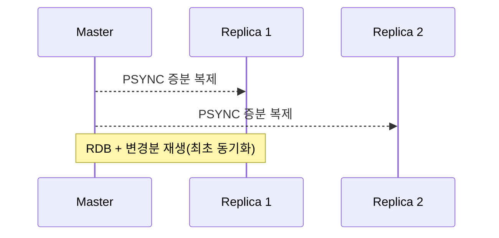
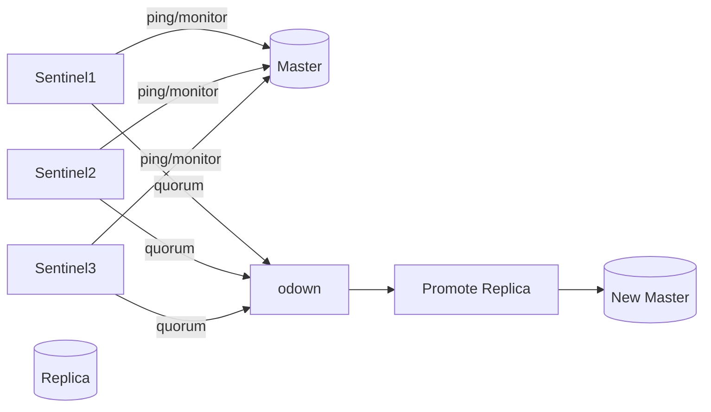

# Chapter 03 운영 관점의 Redis

## 03-2 고가용성과 확장성

### 개요
이 절에서는 Redis의 고가용성(High Availability)과 확장성(Scalability)을 달성하는 핵심 메커니즘을 정리합니다. 복제(Replica)를 통한 읽기 확장과 장애 대비, Sentinel을 통한 자동 장애 조치(Failover), Redis Cluster를 통한 샤딩과 수평 확장, 그리고 상황에 따른 선택 기준과 운영 팁을 실무 관점에서 설명합니다.

### 복제(Replica)와 읽기 확장
- 기본 개념
  - Redis는 비동기 복제를 제공합니다. `replicaof <host> <port>`(구 slaveof)로 마스터를 지정합니다.
  - 초기 동기화: RDB 스냅샷 전송 + 누락된 변경의 재생(PSYNC). 최신 버전은 대부분 증분 재동기화(PSYNC2)를 활용.
- 구성/옵션
  - `repl-diskless-sync yes`: 디스크 없는 복제(파이프 방식)로 초기 동기화 중 I/O 비용과 지연을 줄일 수 있음.
  - `repl-diskless-load <mode>`: 재시작 시 디스크 없는 스냅샷 로드 모드.
  - `min-replicas-to-write`, `min-replicas-max-lag`: 안정성 보강(지연이 큰 경우 쓰기 일시 거부)으로 내구성 향상.
- 읽기 확장
  - 복제본을 읽기 전용으로 활용해 읽기 트래픽을 분산. 단, 강한 일관성이 필요하면 주의(복제 지연/lag 가능).
  - `READONLY` 모드(클러스터) 또는 클라이언트 라우팅으로 replica 대상 읽기.
- 장애 시 고려
  - 비동기 특성상 꼬리 유실(tail loss)이 발생 가능. 강한 내구성이 필요한 경우 외부 트랜잭션 로그/이중 쓰기/Lua 확정 기록 등 보완책 검토.



### Sentinel로 자동 장애 조치
- 개요
  - Sentinel은 여러 프로세스가 협력해 마스터를 감시하고 장애를 판단(sdown/odown)하여 새 마스터 선출/프로모션을 수행합니다.
- 핵심 용어/흐름
  - sdown(Subjective Down): 개별 Sentinel이 마스터 응답 없음 판단.
  - odown(Objective Down): quorum(정족수) 이상의 Sentinel이 합의.
  - 선출: 리더 Sentinel 선출 후 후보 replica 중 승격 대상 선택 → `replicaof no one` → 나머지 replica 재지정.
  - TILT 모드: 시간 왜곡/과부하 상황에서 일시적으로 판단을 보류하는 보호 메커니즘.
- 설정 포인트
  - `sentinel monitor <name> <host> <port> <quorum>`
  - `sentinel down-after-milliseconds`, `failover-timeout`, `parallel-syncs` 등 튜닝.
  - 알림/스크립트: `notification-script`, `client-reconfig-script` 활용.
- 운영 팁
  - 최소 3개 이상 Sentinel 배치, 장애 영역 분리(AZ/서버 분산).
  - 애플리케이션은 Sentinel을 통해 마스터 주소를 동적으로 조회/재연결하도록 구현.



### Redis Cluster로 수평 확장(샤딩)
- 개념
  - 16384 해시 슬롯을 기반으로 키를 자동 샤딩하는 내장 분산 모드. 각 노드는 특정 슬롯 범위를 소유.
  - 클라이언트는 키 해시 결과로 대상 노드를 찾고, 이동 중이면 MOVED/ASK 리다이렉션을 처리.
- 키 해시와 해시태그
  - 기본 해싱은 CRC16(key) % 16384. `{...}` 해시태그를 사용하면 중괄호 내부 부분만 해싱하여 다중 키 연산의 슬롯 일치 보장.
  - 멀티키 연산(MSET, SINTER 등)은 같은 슬롯에서만 허용.
- 가용성과 복제
  - 각 마스터 슬롯 범위에 대한 replica를 구성. 노드 장애 시 replica가 승격되어 슬롯을 이어받음.
- 리샤딩/확장
  - 슬롯 재배치로 수평 확장. `CLUSTER ADDSLOTS`, `CLUSTER DELSLOTS`, `CLUSTER SETSLOT MIGRATING/IMPORTING` 과정 또는 `redis-cli --cluster reshard` 도구 사용.
- 제약/주의
  - 트랜잭션/Lua는 단일 키/슬롯 제한 고려. 키 설계 시 해시태그 활용.
  - multi-key across slots가 필요한 경우 애플리케이션 레벨 집계 또는 프록시 도입 검토.

### 선택 기준과 샤딩 전략
- 단일 인스턴스 + Replica + Sentinel
  - 장점: 운영 단순, 장애 조치 자동화, 대부분 워크로드에 충분.
  - 한계: 단일 마스터의 쓰기 스루풋/메모리 한계.
- Redis Cluster
  - 장점: 수평 확장(쓰기/데이터), 슬롯 단위 내고장성, 자동 리다이렉션.
  - 한계: 크로스-슬롯 연산 제약, 운영 복잡도 증가.
- 클라이언트 샤딩(애플리케이션 레벨)
  - 장점: 유연성, 특정 연산 제약 회피.
  - 한계: 장애 조치/리밸런싱을 직접 구현해야 함.
- 프록시(예: Twemproxy, KeyDB 호환 모드, Envoy 필터 등) 고려는 드뭄. 지연/기능 제약을 평가.

### 운영 팁
- 읽기 스케일 아웃: replica 읽기는 지연 허용 범위에서만. 강한 일관성 필요 구간은 마스터 읽기 또는 `WAIT`로 동기화.
- 클러스터 키 설계: 해시태그로 관련 키를 동일 슬롯에 배치. 멀티키 패턴은 초기에 결정.
- 장애 리허설: Sentinel/Cluster에서 주기적 failover/slot 이동 리허설로 MTTR/운영 숙련도 확보.
- 네트워크/시간: NTP 동기화, TCP keepalive, `cluster-node-timeout`/`down-after-milliseconds` 적절 설정.

### Java/Node.js 예시
- Java (Lettuce)
```java
// Sentinel 기반 연결 (Lettuce)
RedisURI uri = RedisURI.Builder.sentinel("sentinel-host", 26379, "mymaster")
    .withSentinel("sentinel-host-2", 26379)
    .withSentinel("sentinel-host-3", 26379)
    .withPassword("pass".toCharArray())
    .build();
RedisClient client = RedisClient.create(uri);
StatefulRedisConnection<String, String> conn = client.connect();
// 사용 중 장애 발생 시 자동 재해석/재연결
```
- Node.js (ioredis Cluster)
```js
const Redis = require('ioredis');
const cluster = new Redis.Cluster([
  { host: '127.0.0.1', port: 7000 },
  { host: '127.0.0.1', port: 7001 },
  { host: '127.0.0.1', port: 7002 },
]);
// 해시태그로 같은 슬롯 보장
await cluster.mset('{user:42}:name', 'Ada', '{user:42}:age', '31');
```

### 4가지 키워드로 정리하는 핵심 포인트
1. 복제(Replication): 비동기 PSYNC 기반 복제로 읽기 확장과 내고장성을 확보한다.
2. 장애 조치(Failover): Sentinel은 quorum 기반으로 자동 승격/재구성을 수행한다.
3. 클러스터(Cluster): 16384 슬롯 샤딩과 리다이렉션으로 수평 확장을 제공한다.
4. 키 설계(Hash Tag): 해시태그로 관련 키를 같은 슬롯에 배치하여 멀티키 제약을 완화한다.

### 확인 문제
1. Sentinel의 장애 조치 흐름에 대한 설명으로 가장 알맞은 것은?
    - [ ] 개별 Sentinel 한 대가 sdown을 감지하면 즉시 자동 승격을 수행한다.
    - [ ] quorum 이상의 Sentinel이 odown으로 합의하면 리더 Sentinel이 replica를 승격한다.
    - [ ] Sentinel은 마스터 정보를 알리지 않으며 애플리케이션은 수동 재설정이 필요하다.
    - [ ] TILT 모드는 장애 조치를 빠르게 강제하기 위한 가속 모드이다.

2. Redis Cluster에 대한 설명으로 옳은 것은?
    - [ ] 키는 SHA1 해시를 이용해 1024 슬롯으로 분배된다.
    - [ ] `{}` 해시태그를 사용하면 멀티키 연산을 위해 슬롯을 맞출 수 있다.
    - [ ] 클러스터는 멀티키 연산을 모든 슬롯에 걸쳐 자동으로 허용한다.
    - [ ] MOVED/ASK 리다이렉션은 클러스터 외부 프록시에서만 발생한다.

3. [복수 응답] 복제/읽기 확장과 관련된 올바른 운영 방법을 모두 고르세요.
    - [ ] replica 읽기는 복제 지연에 유의하고 강한 일관성 구간에서는 피한다.
    - [ ] `min-replicas-to-write`와 `min-replicas-max-lag`로 내구성 향상을 도모한다.
    - [ ] 디스크 없는 복제(repl-diskless-sync)는 항상 비활성화해야 한다.
    - [ ] 강한 일관성이 필요하면 `WAIT`로 특정 replica 적용을 동기화할 수 있다.
    - [ ] replica에도 자유롭게 쓰기를 허용해 가용성을 높인다.

> [정답 및 해설 보기](../answers_and_explanations.md#03-2-고가용성과-확장성)
