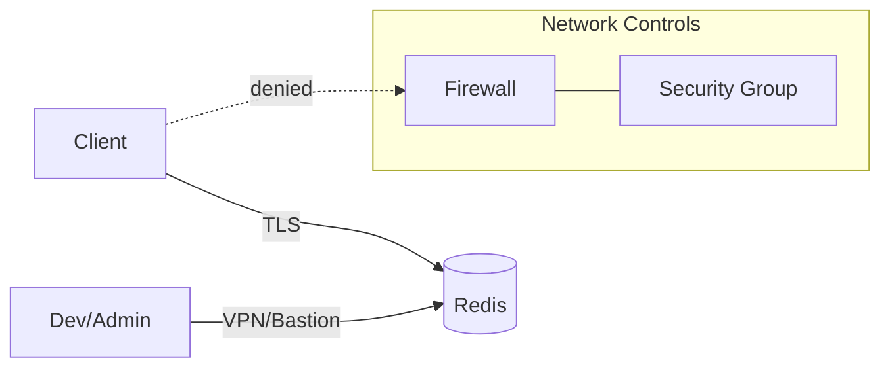
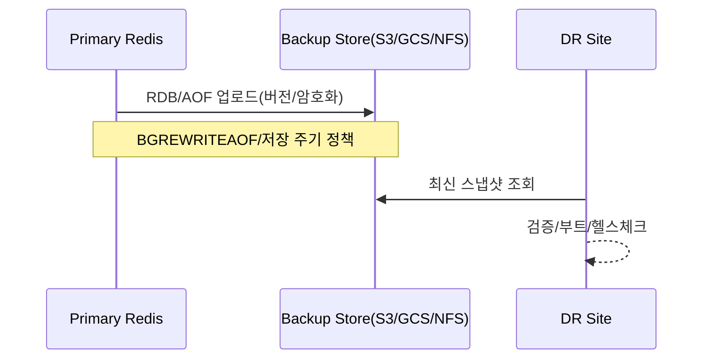

# Chapter 03 운영 관점의 Redis

## 03-3 보안과 운영 베스트 프랙티스

### 개요
이 절에서는 Redis를 안전하고 신뢰성 있게 운영하기 위한 핵심 보안 설정과 운영 베스트 프랙티스를 정리합니다. 인증과 권한(ACL), 네트워크 보안, 구성 하드닝, 백업/복구, 로깅과 관측성, 사고 대응(runbook)까지 Java/Javascript 웹개발 관점에서 실용적으로 설명합니다.

### 인증과 권한: requirepass, ACL
- 기본 인증(requirepass)
  - redis.conf의 `requirepass <password>` 또는 `CONFIG SET requirepass <password>`로 단일 패스워드 인증을 활성화합니다(ACL 이전 호환). 운영에서는 ACL 사용을 권장.
- ACL(Access Control List)
  - 사용자 단위로 권한을 부여: 명령 카테고리(+@hash, -@dangerous), 특정 명령(+GET -FLUSHALL), 키 패턴(~app:*)
  - 예시(관리자/읽기전용/애플리케이션 사용자):
```text
# 관리자: 모든 권한
ACL SETUSER admin on >SuperS3cret allkeys allcommands
# 읽기 전용: GET/MGET/INFO 등만 허용, 쓰기 금지
ACL SETUSER reader on >ReadOnlyP@ss ~app:* +GET +MGET +INFO -@write
# 앱 사용자: app:* 키에 대해 보통 명령 허용
ACL SETUSER app on >AppP@ss ~app:* +@all -@dangerous -FLUSHALL -FLUSHDB
```
  - 확인/로그: `ACL LIST`, `ACL WHOAMI`, `ACL LOG` (최근 권한 거부 이벤트)
  - 비밀번호는 최소 길이/복잡도 정책을 CI/CD 비밀 관리와 함께 운용(KMS, Vault, Secret Manager 등).

### 네트워크 보안과 접근 제어
- 바인드/보호 모드
  - `bind 127.0.0.1` 또는 VPC 전용 IP에 바인드. 퍼블릭 바인드는 피합니다.
  - `protected-mode yes` 유지(기본). 공개망 노출 시 쓰기 차단 등 안전장치.
- 방화벽과 보안 그룹
  - 6379(또는 TLS 포트) 접근을 서비스 서브넷/보안 그룹으로 제한. 관리자 접근은 Bastion/VPN을 통해서만.
- TLS/암호화
  - `tls-port 6379`(또는 별도 포트), `tls-cert-file`, `tls-key-file`, `tls-ca-cert-file` 설정으로 TLS 사용.
  - 클라이언트는 서버 인증서 검증을 활성화하고, 필요 시 mTLS로 상호 인증.
- 유닉스 도메인 소켓
  - 동일 호스트 내 통신은 `unixsocket /var/run/redis.sock` + 파일 권한으로 표면 축소 가능.



### 구성 하드닝과 오용 방지
- 위험 명령 통제
  - `rename-command FLUSHALL ""` 등으로 파괴적 명령 비활성화/난독화.
  - `maxmemory-policy noeviction` 환경에서의 쓰기 실패 처리, 운영 도구는 별도 프리빌리지 계정 사용.
- 출력 버퍼 한도
  - Pub/Sub 남용 방지: `client-output-buffer-limit pubsub 32mb 8mb 60` 등으로 폭주 세션 격리.
- 키스페이스 노출 최소화
  - `notify-keyspace-events`는 필요한 범위만 활성화. KEYS 금지, SCAN 계열 사용 가이드 배포.
- 비밀/구성 관리
  - 평문 비밀번호를 이미지/레포에 포함하지 않기. 환경변수/시크릿 매니저 사용.
- 감사/변경 관리
  - `CONFIG REWRITE`로 지속화하되, 변경은 IaC/PR 리뷰를 통해 추적 가능하게.

### 백업과 복구 전략(RDB/AOF)
- 스냅샷(RDB)
  - `save 900 1` 등 조건부 스냅샷 또는 운영에서는 주로 AOF everysec + 주기적 RDB 백업 병행.
  - RDB 파일은 전송 전 무결성 검사(e.g., `redis-check-rdb`).
- AOF(Append Only File)
  - `appendonly yes`, `appendfsync everysec` 권장(지연/내구성 균형). AOF 재작성(compaction)인 `BGREWRITEAOF` 모니터링.
  - `redis-check-aof`로 점검. AOF/RDB는 암호화된 스토리지/전송 채널 사용.
- 오브젝트 잠금/버전 관리
  - 클라우드 스토리지 버전닝/객체 잠금으로 랜섬웨어/실수 삭제 대비.
- 복구 리허설
  - 주기적으로 DR 복구 리허설을 수행: 아카이브에서 스냅샷 복원→부트→애플리케이션 헬스체크.



### 사고 대응(Incident)과 운영 플레이북
- 1) 감지: 모니터링 경보(INFO, latency, 메모리, 복제 지연, 연결 수)
- 2) 분류: 영향 범위/데이터 손실 가능성/보안 사고 여부
- 3) 완화: 연결 제한, 위험 명령 비활성화, 읽기 전용 전환, 트래픽 셰이핑
- 4) 근본 원인 분석: SLOWLOG, LATENCY, ACL LOG, 서버/네트워크 이벤트 상관
- 5) 복구: 재시작/페일오버/복원/재설정, 변경 롤백
- 6) 사후 검토: 재발 방지 액션(설정 튜닝/알림 임계 조정/테스트 보강)

### 애플리케이션(Java/Node.js) 보안/연결 예시
- Java (Lettuce/Jedis) — ACL 사용자로 TLS 연결
```java
// Lettuce example with TLS and ACL user
RedisURI uri = RedisURI.Builder.redis("example.com", 6380)
    .withSsl(true)
    .withVerifyPeer(true)
    .withPassword("app".toCharArray(), "AppP@ss".toCharArray()) // user, pass
    .build();
RedisClient client = RedisClient.create(uri);
try (StatefulRedisConnection<String,String> conn = client.connect()) {
  var cmd = conn.sync();
  cmd.get("app:key");
}
```
- Node.js (ioredis) — TLS + ACL 사용자
```js
const Redis = require('ioredis');
const redis = new Redis({
  port: 6380,
  host: 'example.com',
  username: 'app',
  password: 'AppP@ss',
  tls: { rejectUnauthorized: true }
});
redis.get('app:key').then(console.log);
```

### 5가지 키워드로 정리하는 핵심 포인트
1. 접근제어(ACL): 사용자/명령/키 패턴 단위 최소 권한 원칙으로 운영한다.
2. 네트워크(TLS/방화벽): 퍼블릭 노출 금지, TLS와 보안 그룹으로 경계 방어를 확립한다.
3. 하드닝(Rename/Buffer): 위험 명령 제어와 출력 버퍼 한도로 오용을 차단한다.
4. 백업/DR: RDB/AOF 병행, 무결성/암호화/버전 관리, 주기적 복구 리허설.
5. 플레이북: 감지→완화→분석→복구→재발 방지의 사이클을 문서화하고 훈련한다.

### 확인 문제
1. Redis ACL에 대한 설명으로 가장 알맞은 것은?
    - [ ] requirepass가 설정되면 ACL은 사용할 수 없다.
    - [ ] ACL은 사용자별로 명령 카테고리와 키 패턴에 기반한 세분 권한 제어를 제공한다.
    - [ ] ACL은 오직 읽기/쓰기 두 가지 권한만 제공한다.
    - [ ] ACL LOG는 느린 명령을 기록한다.

2. 안전한 네트워크 구성을 위해 권장되는 설정 조합은 무엇인가?
    - [ ] 0.0.0.0에 바인드하고 protected-mode를 끈다.
    - [ ] TLS를 활성화하고 신뢰할 수 있는 보안 그룹/방화벽으로 포트를 제한한다.
    - [ ] 인증 없이 내부망에만 두면 충분하다.
    - [ ] 성능을 위해 TLS 대신 평문을 사용한다.

3. [복수 응답] 백업/복구 및 운영 베스트 프랙티스에 대한 올바른 내용을 모두 고르세요.
    - [ ] AOF appendfsync everysec은 내구성과 지연의 균형을 제공한다.
    - [ ] 복구 리허설은 비용이 크므로 실제 장애 때만 수행한다.
    - [ ] RDB/AOF 파일은 업로드 전 무결성 검사를 수행하는 것이 좋다.
    - [ ] Pub/Sub 오용 방지를 위해 client-output-buffer-limit을 설정할 수 있다.
    - [ ] 위험 명령은 rename-command로 비활성화하거나 난독화할 수 있다.

> [정답 및 해설 보기](../answers_and_explanations.md#03-3-보안과-운영-베스트-프랙티스)
