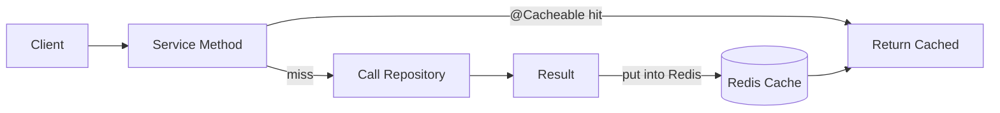
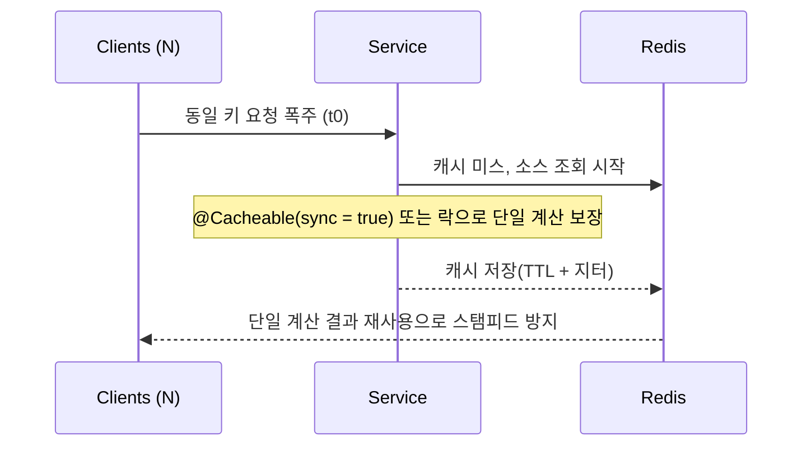

# Chapter 04 실전 활용: Spring Framework와 Java

## 04-1 Spring Cache와 Redis

### 개요
이 절에서는 Spring Cache Abstraction을 Redis와 함께 사용하는 방법을 정리합니다. @Cacheable/@CachePut/@CacheEvict를 활용한 캐싱 전략, 캐시 키 설계와 TTL, 직렬화 설정, 그리고 캐시 스탬피드/스노우볼을 방지하는 실무 팁을 다룹니다. Spring Boot에서 RedisCacheManager 구성 예시와 함께 흔한 함정과 베스트 프랙티스를 제시합니다.

### Spring Cache Abstraction 기본
- 핵심 개념
  - 표준 애노테이션 기반 추상화로, 구현체(예: ConcurrentMap, Redis, Caffeine)를 교체 가능.
  - 프록시 기반으로 메서드 호출 전/후에 캐시 로직을 삽입합니다(같은 클래스 내부 self-invocation은 주의).
- 주요 애노테이션
  - `@Cacheable`: 캐시 조회 후 미스일 때 메서드를 실행하고 결과를 저장.
  - `@CachePut`: 항상 메서드를 실행하고 결과를 캐시에 갱신.
  - `@CacheEvict`: 캐시에서 엔트리를 제거(조건/전체 제거 지원).
  - `@Caching`: 여러 캐시 애노테이션을 조합해 한 메서드에 적용.
- 캐시 이름(Cache Name)과 키
  - `@Cacheable(value = "users", key = "#id")` 형태로 지정. 키는 SpEL을 지원.
  - `unless`, `condition`으로 캐싱/저장 조건을 제어 가능.



### RedisCacheManager 구성과 직렬화/TTL
- 의존성(Gradle)
```groovy
dependencies {
  implementation 'org.springframework.boot:spring-boot-starter-cache'
  implementation 'org.springframework.boot:spring-boot-starter-data-redis'
}
```
- application.yml 기본 설정 예
```yaml
spring:
  cache:
    type: redis
  data:
    redis:
      host: localhost
      port: 6379
```
- Java 구성 예(직렬화 + 기본 TTL + 캐시별 설정)
```java
@Configuration
@EnableCaching
public class CacheConfig {
  @Bean
  public RedisCacheConfiguration redisCacheConfiguration() {
    Jackson2JsonRedisSerializer<Object> serializer =
        new Jackson2JsonRedisSerializer<>(Object.class);
    ObjectMapper om = new ObjectMapper()
        .registerModule(new JavaTimeModule())
        .activateDefaultTyping(om.getPolymorphicTypeValidator(), ObjectMapper.DefaultTyping.NON_FINAL);
    serializer.setObjectMapper(om);

    return RedisCacheConfiguration.defaultCacheConfig()
        .serializeValuesWith(RedisSerializationContext.SerializationPair.fromSerializer(serializer))
        .entryTtl(Duration.ofMinutes(10)) // 기본 TTL 10분
        .disableCachingNullValues();
  }

  @Bean
  public RedisCacheManager cacheManager(RedisConnectionFactory cf, RedisCacheConfiguration base) {
    Map<String, RedisCacheConfiguration> cacheConfigs = new HashMap<>();
    cacheConfigs.put("user", base.entryTtl(Duration.ofMinutes(30)));
    cacheConfigs.put("product", base.entryTtl(Duration.ofMinutes(5)));

    return RedisCacheManager.builder(cf)
        .cacheDefaults(base)
        .withInitialCacheConfigurations(cacheConfigs)
        .transactionAware()
        .build();
  }
}
```
- 주의
  - JSON 직렬화는 가독성/호환성 장점이 있지만 페이로드 크기와 파싱 비용이 큽니다. 필요 시 타입 세이프 Serializer(예: GenericJackson2JsonRedisSerializer) 또는 String/ByteArray 최적화 검토.
  - 다형성 활성화 시 신뢰 경계 외부 입력을 주의(보안). 필요한 타입만 허용하도록 구성하거나 record/DTO 사용 권장.

### 서비스 레이어 사용 예(@Cacheable/@CacheEvict)
```java
@Service
public class UserService {
  private final UserRepository repo;
  public UserService(UserRepository repo) { this.repo = repo; }

  @Cacheable(value = "user", key = "#id")
  public UserDto getUser(long id) {
    return repo.findById(id).map(UserDto::from).orElseThrow();
  }

  @CachePut(value = "user", key = "#user.id")
  public UserDto updateUser(UserDto user) {
    var saved = repo.save(user.toEntity());
    return UserDto.from(saved);
  }

  @CacheEvict(value = "user", key = "#id")
  public void deleteUser(long id) {
    repo.deleteById(id);
  }
}
```
- 패턴
  - 읽기 캐시: @Cacheable로 미스 시 데이터 로딩, 조회 빈도 높은 엔드포인트 최적화.
  - 쓰기 이후 일관성: @CachePut/@CacheEvict로 갱신 또는 제거하여 캐시-소스 불일치 최소화.
  - 조건부 캐시: `unless = "#result == null"` 등으로 null 캐싱 회피.

### 키 설계와 SpEL, 네임스페이스
- 키 설계 원칙
  - 안정적이고 충돌 없는 키: `서비스:도메인:식별자` 형태 권장 예) `app:user:42`.
  - 멀티 테넌시/버전 고려: `tenantId`/`v2` 등 접두어 포함.
  - 파생 질의는 파라미터를 명시적으로 포함: 페이지/필터 조합 → 키가 과도하게 커지지 않도록 해시(SHA-1/xxhash) 사용 고려.
- Spring SpEL 예시
  - `key = "#root.methodName + ':' + #id"`
  - `key = "T(java.util.Locale).getDefault() + ':' + #name"`

### TTL 전략과 만료 정책
- 캐시 데이터 특성에 따라 TTL 차등화: 정적 데이터(길게), 변동 빈번 데이터(짧게).
- 랜덤 지터(jitter) 추가로 동시 만료 스파이크 방지: `baseTtl ± randomDelta`.
- 캐시 프리히트/워밍: 배포 직후 핵심 키를 선로딩하여 콜드 스타트 지연 완화.
- 슬라이딩 TTL이 필요하면 수동 재설정(스프링 캐시 TTL은 기본 고정형). 별도 로직/RedisTemplate 사용 고려.



### 캐시 스탬피드/스노우볼 방지
- @Cacheable(sync = true)
  - 같은 키에 대한 동시 호출을 싱글 플라이트로 수렴(한 쓰레드만 계산).
  - 주의: sync는 동일 인스턴스 내에서만 동작. 분산 환경에서는 분산 락/토큰 버킷 고려.
- 랜덤 지터(Randomized TTL)
  - TTL에 ±랜덤을 주어 대량 키의 동시 만료로 인한 스파이크 방지.
- Early Recompute(Soft TTL)
  - 남은 TTL이 임계값 이하일 때 백그라운드 갱신 트리거(요청은 기존 값 제공). 별도 구현 필요.
- 분산 락
  - Redisson 또는 SET NX PX 기반 간단 락으로 단일 리컴퓨트 보장. 락 홀더 장애/타임아웃 처리 유의.
- 실패 캐시(Fallback Cache)
  - 원천 장애 시 짧은 TTL로 에러/빈 결과 캐싱(서킷브레이커와 병행)로 폭주 보호.

### 실무 체크리스트
- 직렬화 크기 관리: DTO 최소화, 필요 시 압축(Snappy/LZ4) 고려.
- @Cacheable 메서드는 public + 프록시 경로로 호출되도록 구조화(자기 호출 회피).
- 멱등 업데이트: @CachePut 경로에서 재시도 안전성 확보.
- 관측성: `spring.cache` 메트릭, Redis 명령 통계(INFO commandstats), SLOWLOG 모니터링.
- 운영: maxmemory 정책/TTL 점검, 큰 밸류는 해시 필드 분할.

### 5가지 키워드로 정리하는 핵심 포인트
1. 추상화(Abstraction): Spring Cache 애노테이션으로 구현체를 유연하게 교체한다.
2. TTL/직렬화(TTL/Serialization): RedisCacheConfiguration으로 TTL과 Serializer를 명시한다.
3. 키 설계(Key Design): SpEL/네임스페이스로 충돌 없이 예측 가능한 키를 만든다.
4. 스탬피드 방지(Stampede): sync/지터/락/early recompute로 폭주를 막는다.
5. 일관성(Consistency): @CachePut/@CacheEvict로 원본과 캐시의 동기화를 유지한다.

### 확인 문제
1. Spring Cache에서 @Cacheable의 올바른 설명은 무엇인가?
    - [ ] 항상 메서드를 실행한 뒤 결과를 캐시에 저장한다.
    - [ ] 캐시에서 조회하여 히트 시 메서드를 실행하지 않으며, 미스 시 결과를 저장한다.
    - [ ] 캐시와 무관하게 캐시 엔트리를 제거한다.
    - [ ] 여러 캐시 작업을 조합할 수 있도록 한다.

2. RedisCacheManager 구성과 관련한 설명으로 옳은 것은?
    - [ ] 기본 TTL은 설정할 수 없으며, 모든 캐시는 무기한 유지된다.
    - [ ] 값 직렬화 방식을 지정해 JSON으로 저장하도록 설정할 수 있다.
    - [ ] RedisCacheManager는 트랜잭션과 함께 사용할 수 없다.
    - [ ] 캐시 이름별로 TTL을 달리 설정할 수 없다.

3. [복수 응답] 캐시 스탬피드/스노우볼 방지 방법으로 옳은 것을 모두 고르세요.
    - [ ] @Cacheable(sync = true)로 동일 키 동시 호출을 단일 계산으로 수렴한다.
    - [ ] TTL에 랜덤 지터를 추가해 동시 만료를 분산한다.
    - [ ] 모든 키 TTL을 동일 시간으로 맞춰 일관성을 높인다.
    - [ ] 분산 락이나 Early Recompute(Soft TTL) 전략을 사용한다.
    - [ ] 캐시를 비활성화하면 스탬피드가 자동으로 사라진다.

> [정답 및 해설 보기](../answers_and_explanations.md#04-1-spring-cache와-redis)
