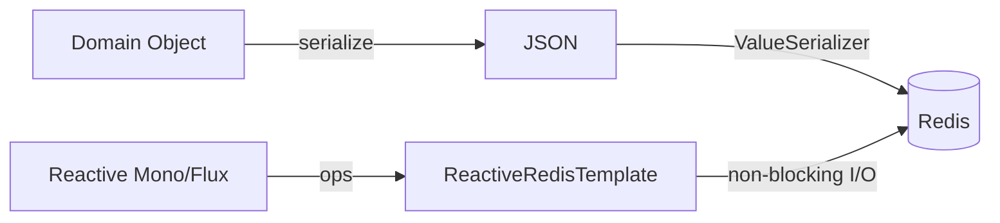

# Chapter 04 실전 활용: Spring Framework와 Java

## 04-2 RedisTemplate과 ReactiveRedisTemplate

### 개요
이 절에서는 Spring Data Redis의 핵심 클라이언트인 RedisTemplate과 ReactiveRedisTemplate 사용법을 정리합니다. 직렬화 설정(String/JSON), 타입 안전성 이슈와 해결책, 기본 CRUD/배치/파이프라이닝/트랜잭션 패턴, 그리고 Reactive(논블로킹) API의 차이점과 주의점을 다룹니다. 끝으로 실습 예제로 세션 스토어와 토큰 블랙리스트 구현 아이디어를 제시합니다.

### RedisTemplate 기본: 연결/직렬화/타입 안전성
- 연결 팩토리
  - LettuceConnectionFactory(권장, 넌블로킹/스레드세이프) 또는 JedisConnectionFactory를 사용합니다.
- 직렬화 구성
  - 기본 JdkSerializationRedisSerializer는 호환성과 가독성이 떨어질 수 있으므로, 일반적으로 다음을 권장합니다:
    - Key/HashKey: StringRedisSerializer
    - Value/HashValue: GenericJackson2JsonRedisSerializer 또는 Jackson2JsonRedisSerializer<T>
- 타입 안전성과 클래스 정보
  - GenericJackson2JsonRedisSerializer는 타입 정보를 포함하여 다양한 타입을 안전하게 역직렬화합니다.
  - Jackson2JsonRedisSerializer<T>는 명시 타입에 최적화(작고 빠름)되나 다형성 객체에는 주의.
- 예시 구성(Java Config)
```java
@Configuration
public class RedisConfig {
  @Bean
  public RedisConnectionFactory redisConnectionFactory() {
    return new LettuceConnectionFactory("localhost", 6379);
  }

  @Bean
  public RedisTemplate<String, Object> redisTemplate(RedisConnectionFactory cf) {
    RedisTemplate<String, Object> tpl = new RedisTemplate<>();
    tpl.setConnectionFactory(cf);
    // serializers
    StringRedisSerializer keySer = new StringRedisSerializer();
    GenericJackson2JsonRedisSerializer valSer = new GenericJackson2JsonRedisSerializer();
    tpl.setKeySerializer(keySer);
    tpl.setHashKeySerializer(keySer);
    tpl.setValueSerializer(valSer);
    tpl.setHashValueSerializer(valSer);
    tpl.afterPropertiesSet();
    return tpl;
  }
}
```

#### CRUD 사용 패턴(String/Hash/List/Set/ZSet)
```java
@Service
public class SampleService {
  private final ValueOperations<String, Object> values;
  private final HashOperations<String, String, Object> hashes;
  private final ListOperations<String, Object> lists;
  private final SetOperations<String, Object> sets;
  private final ZSetOperations<String, Object> zsets;
  private final RedisTemplate<String, Object> redis;

  public SampleService(RedisTemplate<String, Object> redis) {
    this.redis = redis;
    this.values = redis.opsForValue();
    this.hashes = redis.opsForHash();
    this.lists = redis.opsForList();
    this.sets = redis.opsForSet();
    this.zsets = redis.opsForZSet();
  }

  public void basicOps() {
    values.set("app:counter", 1);
    values.increment("app:counter");
    hashes.put("app:user:42", "name", "Ada");
    lists.leftPush("queue:jobs", Map.of("id", 1001));
    sets.add("tags:post:1", "redis", "java");
    zsets.add("leaderboard", "user42", 987.0);
  }
}
```

### 파이프라이닝과 트랜잭션(MULTI/EXEC)
- 파이프라이닝
  - 네트워크 RTT 절감을 위해 다수의 명령을 한 번에 전송합니다. 응답은 일괄 수신되며 원자성은 보장하지 않습니다.
  - 예시:
```java
List<Object> results = redis.executePipelined((RedisCallback<Object>) connection -> {
  var ser = new StringRedisSerializer();
  for (int i = 0; i < 1000; i++) {
    byte[] k = ser.serialize("k:" + i);
    byte[] v = ser.serialize(Integer.toString(i));
    connection.stringCommands().set(k, v);
  }
  return null; // 중요: 파이프라인 안에서 즉시 결과를 쓰지 않음
});
```
- 트랜잭션
  - RedisTemplate은 SESSION(연결) 기반 트랜잭션을 지원합니다. MULTI/EXEC 사이에 큐잉되며 EXEC에서 일괄 실행됩니다.
  - 예시:
```java
List<Object> txResults = redis.execute(session -> {
  session.multi();
  session.opsForValue().set("tx:a", "1");
  session.opsForValue().increment("tx:a");
  return session.exec();
});
```
- 트랜잭션 + 직렬화 주의
  - 트랜잭션 범위에서도 동일 Serializer가 적용됩니다. 키/값 Serializer 불일치가 없도록 통일하세요.

### 스크립트(Lua) 실행
```java
DefaultRedisScript<Long> script = new DefaultRedisScript<>();
script.setScriptText("return redis.call('INCRBY', KEYS[1], ARGV[1])");
script.setResultType(Long.class);
Long r = redis.execute(script, List.of("app:counter"), "2");
```
- Reactive에서도 `reactive.execute(script, keys, args)` 대응 메서드를 사용할 수 있습니다.

### ReactiveRedisTemplate: 논블로킹 사용법
- 직렬화 컨텍스트 구성
```java
@Configuration
class ReactiveRedisConfig {
  @Bean
  public ReactiveRedisConnectionFactory reactiveConnectionFactory() {
    return new LettuceConnectionFactory("localhost", 6379);
  }

  @Bean
  public ReactiveRedisTemplate<String, MyDto> reactiveRedisTemplate(ReactiveRedisConnectionFactory cf) {
    Jackson2JsonRedisSerializer<MyDto> serializer = new Jackson2JsonRedisSerializer<>(MyDto.class);
    RedisSerializationContext<String, MyDto> ctx = RedisSerializationContext
        .<String, MyDto>newSerializationContext(new StringRedisSerializer())
        .value(serializer)
        .hashKey(new StringRedisSerializer())
        .hashValue(serializer)
        .build();
    return new ReactiveRedisTemplate<>(cf, ctx);
  }
}
```
- 기본 사용 예시
```java
@Service
class ReactiveService {
  private final ReactiveValueOperations<String, MyDto> values;
  private final ReactiveRedisTemplate<String, MyDto> reactive;
  ReactiveService(ReactiveRedisTemplate<String, MyDto> reactive) {
    this.reactive = reactive;
    this.values = reactive.opsForValue();
  }
  public Mono<MyDto> getOrLoad(String key) {
    return values.get(key)
      .switchIfEmpty(loadFromSource(key).flatMap(dto ->
        values.set(key, dto).thenReturn(dto)
      ));
  }
  private Mono<MyDto> loadFromSource(String key) { /* ... */ return Mono.just(new MyDto(key)); }
}
```
- Reactive 주의사항
  - backpressure는 Reactor(Flux/Mono)로 관리합니다. Redis 서버는 여전히 단일 스레드 이벤트 루프이므로 과도한 동시성은 지연을 유발할 수 있습니다.
  - MULTI/EXEC 트랜잭션을 리액티브 체인에 엮을 때는 같은 연결 컨텍스트가 필요합니다. `reactive.executeInTransaction` 등을 활용하고, 긴 블로킹 작업을 체인에 포함시키지 마세요.



### 실습 예 1: 세션 스토어(간단)
- 키: `sess:{sessionId}`
- 값: UserSummary JSON, TTL: 30분
```java
public Mono<Void> saveSession(String sid, UserSummary u) {
  return reactive.opsForValue().set("sess:"+sid, u, Duration.ofMinutes(30)).then();
}
public Mono<UserSummary> loadSession(String sid) {
  return reactive.opsForValue().get("sess:"+sid);
}
```
- 팁: TTL 갱신(슬라이딩 세션) 필요 시 접근 시점에 `EXPIRE` 또는 `set(..., Duration)` 재호출.

### 실습 예 2: 토큰 블랙리스트(JWT revoke)
- 아이디어: JWT 만료(exp)까지 남은 시간만큼 키 TTL을 설정.
```java
public void blacklistToken(String jti, Duration ttl) {
  values.set("jwt:blk:" + jti, true);
  redis.expire("jwt:blk:" + jti, ttl);
}
public boolean isBlacklisted(String jti) {
  Boolean v = (Boolean) values.get("jwt:blk:" + jti);
  return Boolean.TRUE.equals(v);
}
```
- Reactive 버전은 `reactive.expire(key, ttl)` 또는 `opsForValue().set(key, val, ttl)` 사용.

### 운영 팁
- 직렬화 일관성: 템플릿별 Serializer를 명시적으로 지정. 혼용 시 디버깅 난이도↑.
- 네임스페이스: `app:domain:id` 형식 키 네임스페이스를 통일. 멀티테넌시/버전 접두어 고려.
- 파이프라인 크기: 너무 크게 잡지 말고 수천 단위 내에서 점진 적용, 에러 시 멱등 재시도.
- 트랜잭션: 필요한 최소 범위로 짧게. WATCH 패턴은 스크립트(Lua) 대안 검토.
- Reactive: 블로킹 작업을 체인에 두지 말고 별도 스케줄러/서비스로 분리.

### 5가지 키워드로 정리하는 핵심 포인트
1. 직렬화(Serialization): String 키 + JSON 값 조합으로 가독성과 호환성을 확보한다.
2. 타입 안전(Type Safety): GenericJackson2JsonRedisSerializer나 명시 타입 Serializer로 역직렬화 안전성을 보장한다.
3. 배치/성능(Pipeline): executePipelined로 RTT를 절감하되 원자성이 아님을 이해한다.
4. 트랜잭션(Transaction): MULTI/EXEC 패턴을 짧고 명확하게 사용한다.
5. Reactive(논블로킹): ReactiveRedisTemplate로 Mono/Flux 기반 비동기 흐름을 구성한다.

### 확인 문제
1. RedisTemplate 직렬화 구성에 대한 설명으로 가장 알맞은 것은?
    - [ ] 기본 JDK 직렬화를 그대로 쓰는 것이 일반적으로 가장 호환성과 가독성이 좋다.
    - [ ] Key/HashKey는 StringRedisSerializer, Value는 JSON Serializer를 사용하는 구성이 흔하다.
    - [ ] Key와 Value 모두 같은 Serializer를 써야 하므로 JSON을 Key에도 적용하는 것이 권장된다.
    - [ ] 직렬화는 성능에 영향을 주지 않으므로 기본값을 유지해도 무방하다.

2. ReactiveRedisTemplate 사용 시 주의사항으로 옳은 것은?
    - [ ] MULTI/EXEC 트랜잭션은 리액티브 체인과 무관하며 어떤 연결에서도 자동으로 일관되게 처리된다.
    - [ ] Reactive에서는 백프레셔 개념이 없어 무한 스트림을 그대로 흘려도 안전하다.
    - [ ] 리액티브 체인 내에서 블로킹 작업을 피하고, 같은 연결 컨텍스트에서 트랜잭션을 실행해야 한다.
    - [ ] Reactive API는 직렬화를 지원하지 않는다.

3. [복수 응답] 다음 중 파이프라이닝/트랜잭션에 대한 올바른 설명을 모두 고르세요.
    - [ ] 파이프라이닝은 RTT를 줄여 처리량을 높일 수 있지만 원자성을 보장하지 않는다.
    - [ ] MULTI/EXEC 트랜잭션은 큐잉 후 EXEC에서 일괄 실행된다.
    - [ ] 파이프라이닝은 항상 트랜잭션보다 데이터 일관성이 높다.
    - [ ] 파이프라이닝은 너무 크게 잡으면 메모리/지연이 증가할 수 있다.
    - [ ] 트랜잭션은 직렬화 설정과 무관하게 항상 문자열로 저장한다.

> [정답 및 해설 보기](../answers_and_explanations.md#04-2-redistemplate과-reactiveredistemplate)
