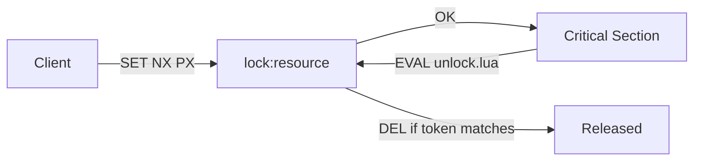
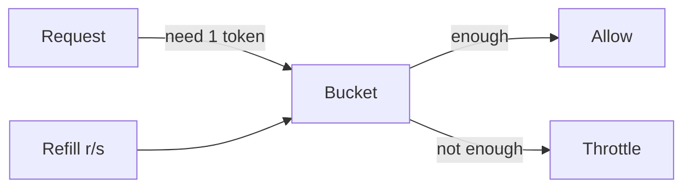

# Chapter 04 실전 활용: Spring Framework와 Java

## 04-3 분산 락/레이트 리미팅/메시징

### 개요
이 절에서는 Redis를 활용한 세 가지 실전 패턴을 다룹니다. (1) 분산 락으로 단일 자원 갱신을 보호하는 방법, (2) 레이트 리미팅으로 트래픽을 제어하는 방법, (3) Pub/Sub과 Streams를 애플리케이션 패턴에서 효율적으로 사용하는 방법을 정리합니다. 각 주제별로 동작 원리, 주의점, Java/Node.js 코드 스니펫과 Mermaid 다이어그램을 포함합니다.

### 분산 락 패턴: SET NX PX와 Redisson
- 왜 필요한가
  - 다중 인스턴스 환경에서 동일 자원(예: 재고, 배치 작업) 갱신 충돌을 방지하고 "오직 하나"의 워커만 임계 구역을 실행하도록 보장합니다.
- 기본 원리(SET NX PX)
  - 획득: `SET lock:resource unique-token NX PX <ttl-ms>`
  - 해제: Lua로 소유자 검증 후 삭제
  - TTL은 필수(홀더 장애 시 데드락 방지). TTL은 임계 구역 최대 실행시간+여유로 설정, 혹은 갱신 로직 사용.
- 올바른 해제(Lua)
```lua
-- KEYS[1]=lock key, ARGV[1]=token
if redis.call('GET', KEYS[1]) == ARGV[1] then
  return redis.call('DEL', KEYS[1])
else
  return 0
end
```
- Java(Lettuce) 의사 코드
```java
String key = "lock:job:daily";
String token = UUID.randomUUID().toString();
String ok = cmd.set(key, token, SetArgs.Builder.nx().px(15000));
if ("OK".equals(ok)) {
  try {
    // 임계 구역 수행
  } finally {
    // Lua로 안전한 해제
    String script = "if redis.call('GET', KEYS[1]) == ARGV[1] then return redis.call('DEL', KEYS[1]) else return 0 end";
    cmd.eval(script, ScriptOutputType.INTEGER, new String[]{key}, token);
  }
}
```
- Redisson 사용(권장)
  - `RLock`은 Watchdog 자동 연장(기본 30s)으로 작업시간 가변일 때 유리.
```java
RedissonClient redisson = Redisson.create();
RLock lock = redisson.getLock("lock:job:daily");
boolean acquired = lock.tryLock(5, 30, TimeUnit.SECONDS); // 대기 5s, 임대 30s
try {
  if (acquired) {
    // 작업 수행
  }
} finally {
  if (acquired) lock.unlock();
}
```
- 주의점
  - 시계/네트워크 지연에 취약한 단순 락: 토큰 검증 필수, TTL 설정/연장 전략, 장애 시 중복 실행 허용 범위 정의.
  - Redis Cluster에서는 락 키에 해시태그로 슬롯 고정: `lock:{resource}`.



### 레이트 리미팅 패턴: 토큰 버킷/슬라이딩 윈도우
- 선택지 개요
  - Fixed Window: 구현 간단, 경계 효과 존재
  - Sliding Window(Log/Counter): 경계 완화, 저장비용/연산 증가
  - Token Bucket: 평균률 + 버스트 허용(실무 인기)
- Token Bucket 핵심
  - 버킷 용량(C), 보충률(r tokens/sec), 현재 토큰 수(T). 요청 1개당 1 토큰 소비, 부족하면 거부/대기.
- Lua 스크립트(원자적 적용)
```lua
-- KEYS[1]=bucket key
-- ARGV[1]=now(ms), ARGV[2]=refill_rate(tokens/ms), ARGV[3]=capacity, ARGV[4]=cost
local now = tonumber(ARGV[1])
local rate = tonumber(ARGV[2])
local cap = tonumber(ARGV[3])
local cost = tonumber(ARGV[4])
local data = redis.call('HMGET', KEYS[1], 'tokens', 'ts')
local tokens = tonumber(data[1]) or cap
local ts = tonumber(data[2]) or now
-- refill
local delta = math.max(0, now - ts)
local filled = math.min(cap, tokens + delta * rate)
local allowed = 0
if filled >= cost then
  tokens = filled - cost
  ts = now
  allowed = 1
else
  tokens = filled
  ts = now
end
redis.call('HMSET', KEYS[1], 'tokens', tokens, 'ts', ts)
redis.call('PEXPIRE', KEYS[1], 60000)
return {allowed, tokens}
```
- Java 호출 예(Lettuce)
```java
String script = "...위 스크립트...";
Long now = System.currentTimeMillis();
double ratePerMs = 5.0 / 1000.0; // 초당 5
Long cap = 20L;
Long cost = 1L;
Object res = cmd.eval(script, ScriptOutputType.MULTI, new String[]{"rl:{user:42}"},
  now.toString(), Double.toString(ratePerMs), cap.toString(), cost.toString());
// res -> [allowed(int), tokens(remaining)]
```
- 슬라이딩 윈도우(카운터) 간단 버전
  - 키: `rl:{ip}:<currentMinute>` 증가 + TTL 2분, 분당 N 제한. 경계 효과 감소엔 log 기반/정교한 윈도우 사용.
- 실무 팁
  - 키 네임스페이스: `rl:{tenant}:{subject}`
  - 클러스터: 해시태그로 슬롯 고정, Lua의 KEYS[1] 단일 슬롯 유지.
  - 모니터링: 허용/거부 비율, 대기시간, 토큰 잔량 분포.



### 애플리케이션 메시징 패턴(Pub/Sub & Streams)
- Pub/Sub로 알림, Streams로 작업 처리
  - Pub/Sub: 경량 신호(예: "새 게시물") → 소비자는 상세는 DB/캐시 조회
  - Streams + Consumer Group: 작업 큐/이벤트 처리 파이프라인(ack/재시도/PEL/DLQ)
- Streams 소비자 그룹 예(Lettuce)
```java
// 생산
cmd.xadd("events", Map.of("type","signup","user","42"));
// 그룹 생성(최초 1회)
try { cmd.xgroupCreate(XReadArgs.StreamOffset.from("events", "$"), "g1"); } catch (Exception ignore) {}
// 소비
var msgs = cmd.xreadgroup(Consumer.from("g1","c1"), XReadArgs.StreamOffset.lastConsumed("events"));
for (var m: msgs) {
  try {
    // 처리
    cmd.xack("events","g1", m.getId());
  } catch (Exception e) {
    // 재시도 횟수 증가/로그, 필요 시 DLQ로 XADD
  }
}
```
- Node.js (ioredis) Pub/Sub
```js
const Redis = require('ioredis');
const sub = new Redis();
const pub = new Redis();
sub.subscribe('notif:post');
sub.on('message', (ch, msg) => console.log('event', ch, msg));
pub.publish('notif:post', JSON.stringify({ postId: 1001 }));
```
- 운영 팁
  - Streams: `MAXLEN ~`으로 트리밍, XPENDING/XAUTOCLAIM으로 느린 컨슈머 처리, 멱등성 보장.
  - Pub/Sub: 일시 손실 허용 트래픽에만 사용, 출력 버퍼 한도 설정.

### 5가지 키워드로 정리하는 핵심 포인트
1. 안전 락(Safe Lock): SET NX PX + 토큰 + Lua 해제로 소유자만 해제한다.
2. 자동 연장(Watchdog): Redisson 락은 작업시간 가변에 유리하다.
3. 토큰 버킷(Rate Limit): Lua로 원자적으로 보충/소비하여 평균률과 버스트를 제어한다.
4. 슬롯 고정(Hash Tag): 클러스터에서 락/리밋 키는 해시태그로 단일 슬롯에 고정한다.
5. 메시징 선택(Patterns): Pub/Sub은 신호, Streams는 내구성/ack 기반 처리에 사용한다.

### 확인 문제
1. 분산 락 해제에 대한 올바른 설명은 무엇인가?
    - [ ] DEL lock:key로 간단히 지우면 된다(누가 락을 갖고 있든 상관없다).
    - [ ] SET NX로 락을 잡았으면 TTL이 있으니 해제는 불필요하다.
    - [ ] GET으로 토큰을 검증한 뒤 일치할 때만 DEL 해야 한다(보통 Lua 스크립트를 사용).
    - [ ] 같은 키로 여러 인스턴스가 동시에 UNLOCK을 시도해야 안전하다.

2. 토큰 버킷 레이트 리미터에 대한 설명으로 옳은 것은?
    - [ ] 토큰 버킷은 버스트를 전혀 허용하지 않는다.
    - [ ] 토큰 버킷은 평균 처리율을 유지하면서 최대 용량 내 버스트를 허용한다.
    - [ ] 토큰 버킷은 항상 Sliding Window보다 정확하다.
    - [ ] 토큰 버킷 구현에는 Lua를 사용할 수 없고 트랜잭션만 가능하다.

3. [복수 응답] Redis Cluster에서 락/레이트 리미트 키 설계와 운영에 대한 올바른 내용을 모두 고르세요.
    - [ ] `lock:{order:42}`와 같이 해시태그를 사용해 단일 슬롯에 고정한다.
    - [ ] 레이트 리미트 Lua 스크립트는 되도록 여러 키를 섞어 다양한 슬롯을 동시에 갱신한다.
    - [ ] 토큰 버킷 상태는 해시(HMSET) 등 단일 키에 보관해 스크립트 내 원자 연산을 보장한다.
    - [ ] Streams 기반 워크큐는 XPENDING/XAUTOCLAIM을 활용해 느린 소비자 처리와 재할당을 설계한다.
    - [ ] Pub/Sub은 오프라인 컨슈머에게도 자동 재전송/저장이 보장된다.

> [정답 및 해설 보기](../answers_and_explanations.md#04-3-분산-락레이트-리미팅메시징)
