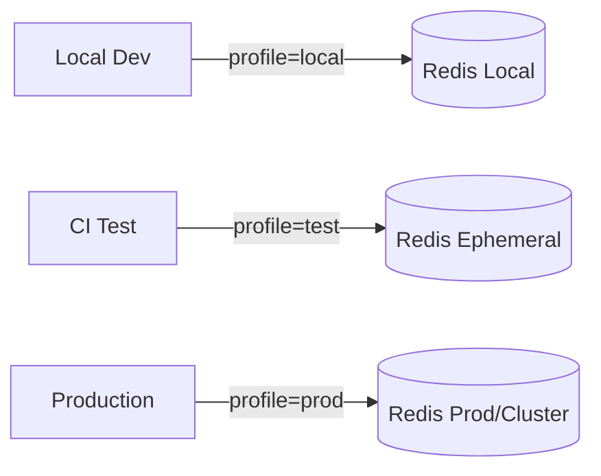
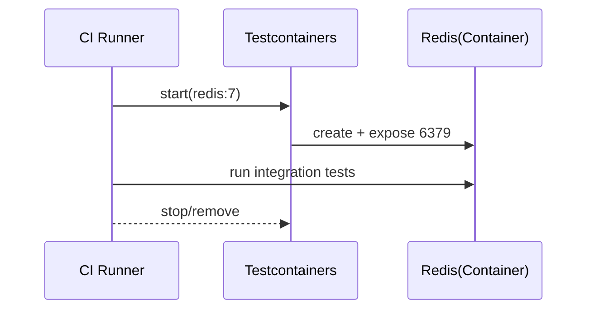

# Chapter 04 실전 활용: Spring Framework와 Java

## 04-4 구성과 운영 팁

### 개요
이 절에서는 웹 애플리케이션(Java/Spring, Node.js/React)을 개발/운영할 때 Redis를 안정적으로 사용하기 위한 ‘환경 구성과 운영 팁’을 정리합니다. 로컬/테스트/프로덕션 프로파일 구성, Docker Compose 기반 로컬 개발 환경, Testcontainers를 활용한 통합 테스트, 모니터링/알림 및 장애 대응 플레이북까지 실무 관점에서 설명합니다.

### 환경/프로파일 구성(Local/Test/Prod)
- Spring Profiles
  - application.yml 분리: `application-local.yml`, `application-test.yml`, `application-prod.yml`
  - 예시
```yaml
# application.yml
spring:
  data:
    redis:
      host: localhost
      port: 6379
---
spring:
  config:
    activate:
      on-profile: prod
  data:
    redis:
      host: ${REDIS_HOST}
      port: ${REDIS_PORT:6379}
      username: ${REDIS_USERNAME:}
      password: ${REDIS_PASSWORD:}
```
  - 애플리케이션 기동: `-Dspring.profiles.active=local|test|prod`
- Node.js (ioredis/node-redis)
  - 환경 변수로 분기
```js
const env = process.env.NODE_ENV || 'local';
const cfg = {
  local: { host: '127.0.0.1', port: 6379 },
  test:  { host: process.env.REDIS_HOST || '127.0.0.1', port: 6379 },
  prod:  { host: process.env.REDIS_HOST, port: Number(process.env.REDIS_PORT||6379),
           username: process.env.REDIS_USERNAME, password: process.env.REDIS_PASSWORD,
           tls: process.env.REDIS_TLS === 'true' ? { rejectUnauthorized: true } : undefined },
}[env];
```
- 구성 원칙
  - 자격 정보/호스트는 환경 변수나 시크릿 매니저에서 주입.
  - 키 네임스페이스에 환경 접두어 사용 권장: `dev:app:*`, `stg:app:*`, `prod:app:*`.
  - 위험 명령/관측 옵션은 prod에서 최소화(예: MONITOR 비활성, notify-keyspace-events 제한적 활성).



### 로컬 개발: Docker Compose
- 최소 compose 예시
```yaml
# docker-compose.yml
version: '3.8'
services:
  redis:
    image: redis:7
    ports:
      - '6379:6379'
    command: ["redis-server", "--appendonly", "yes", "--save", "", "--appendfsync", "everysec"]
    volumes:
      - ./data:/data
```
- 팁
  - AOF everysec로 내구성/성능 균형. 로컬은 RDB 스냅샷(save) 비활성화로 단순화 가능.
  - Pub/Sub 폭주 방지: 필요 시 `client-output-buffer-limit pubsub 32mb 8mb 60`.
  - TLS가 필요한 경우 자체 CA/서명 인증서로 `tls-port`, cert/key 설정. 클라이언트는 검증 활성화.

### 통합 테스트: Testcontainers/에페메럴 Redis
- Java (Testcontainers)
```java
@Testcontainers
class RedisIT {
  @Container
  static GenericContainer<?> redis = new GenericContainer<>(DockerImageName.parse("redis:7"))
      .withExposedPorts(6379)
      .withCommand("redis-server", "--appendonly", "no");

  @DynamicPropertySource
  static void props(DynamicPropertyRegistry r) {
    r.add("spring.data.redis.host", () -> redis.getHost());
    r.add("spring.data.redis.port", () -> redis.getMappedPort(6379));
  }

  @Test
  void ping() {
    var uri = "redis://" + redis.getHost() + ":" + redis.getMappedPort(6379);
    var client = io.lettuce.core.RedisClient.create(uri);
    try (var conn = client.connect()) {
      assertEquals("PONG", conn.sync().ping());
    }
  }
}
```
- Node.js (testcontainers-js)
```js
import { GenericContainer } from 'testcontainers';
import Redis from 'ioredis';

test('ping', async () => {
  const container = await new GenericContainer('redis:7').withExposedPorts(6379).start();
  const redis = new Redis(container.getMappedPort(6379), container.getHost());
  expect(await redis.ping()).toBe('PONG');
  await redis.quit();
  await container.stop();
});
```
- CI 팁
  - 테스트 격리: 각 테스트 스위트는 독립 컨테이너/DB를 사용.
  - seed/fixtures는 SCAN/FLUSH 사용 대신 명시적 키 네임스페이스로 생성 후 정리.



### 운영 모니터링/알림
- 메트릭/로그 수집
  - INFO stats/commandstats/memory, SLOWLOG, LATENCY, keyspace 히스토그램.
  - Exporter: redis_exporter(Prometheus), Cloud vendor metrics, APM 연계.
- 주요 알림 지표 예
  - used_memory, mem_fragmentation_ratio, evicted_keys, rejected_connections
  - instantaneous_ops_per_sec, total_net_input_bytes/output_bytes
  - replication_offset lag(복제 지연), connected_clients, blocked_clients
  - slowlog_len, latency spikes(doctor events)
- 대시보드 팁
  - 쓰기/읽기 QPS, 오류율, RTT 분포, 키 적체 지표(Streams: XPENDING/XINFO)
- 알림 임계 관리
  - 소음 방지: 버스트 허용치, 관찰 기간 설정. 장애 징후 조합 규칙(예: evicted_keys 증가 + hit ratio 급락).

### 장애 대응 플레이북(Incident Runbook)
- 1) 감지: 알림/대시보드에서 이상 징후 확인(메모리 급증, 에러율 증가, replica lag 증가)
- 2) 분류: 영향 반경(캐시/소스 DB/전체), 데이터 손실 가능성, 보안 이슈 여부
- 3) 즉시 완화(Mitigation)
  - 캐시 스톰: @Cacheable(sync)/지터 재확인, 임시적으로 TTL 분산 확대, 일부 트래픽 셰이핑
  - 메모리 압력: MAXLEN/트리밍 조정(Streams), 덩치 큰 키 제거/압축, maxmemory-policy 재검토
  - 네트워크/복제: replica 읽기 전환/차단, `WAIT`로 쓰기 동기화 구간 한정
- 4) 원인 분석
  - SLOWLOG/LATENCY/commandstats, 애플리케이션 릴리즈/쿼리 변경 상관
  - ACL LOG/보안 이벤트 점검(접근 급증 등)
- 5) 복구/정상화
  - Sentinel/Cluster 자동 복구 모니터, 재시작/페일오버 판단
  - 설정 변경은 IaC/PR로 반영, `CONFIG REWRITE` 시 주의
- 6) 사후 리뷰/예방
  - 핫키/빅밸류/쏠림 완화 설계, 알림 임계 재조정, 테스트 추가(Testcontainers 시나리오)

### 4가지 키워드로 정리하는 핵심 포인트
1. 프로파일(Profiles): 환경별 분리와 시크릿 주입으로 안전하고 일관된 구성을 유지한다.
2. 재현성(Reproducibility): Docker Compose/Testcontainers로 로컬·CI에서 동일한 Redis 환경을 재현한다.
3. 가시성(Observability): 메트릭/로그/트레이싱으로 상태를 가시화하고 노이즈 없는 알림을 설계한다.
4. 플레이북(Runbook): 감지→완화→분석→복구→예방 사이클을 문서화하고 주기적으로 리허설한다.

### 확인 문제
1. 환경별 구성에 대한 설명으로 가장 알맞은 것은?
    - [ ] prod에서도 개발 편의를 위해 MONITOR를 상시 활성화한다.
    - [ ] Spring/Node 모두 환경 변수를 통해 Redis 호스트/자격을 주입하고, 키 네임스페이스에 환경 접두어를 두면 혼선을 줄일 수 있다.
    - [ ] 모든 환경에서 동일한 Redis를 공유해 데이터 일관성을 높인다.
    - [ ] 애플리케이션에서 비밀번호는 하드코딩하여 배포 안정성을 높인다.

2. 통합 테스트 구성(Testcontainers 등)에 대한 설명으로 옳은 것은?
    - [ ] 운영 Redis에 직접 붙어야 실제와 같으므로 가장 안전하다.
    - [ ] Testcontainers로 에페메럴 Redis 컨테이너를 띄워 테스트 격리와 재현성을 확보할 수 있다.
    - [ ] 성능을 위해 여러 테스트가 하나의 컨테이너를 항상 공유해야 한다.
    - [ ] 데이터 정리는 FLUSHALL을 무조건 실행하는 것이 최선이다.

3. [복수 응답] 운영 모니터링/알림 및 플레이북에 대한 올바른 항목을 모두 고르세요.
    - [ ] evicted_keys 급증과 캐시 hit ratio 급락은 메모리 압력 또는 TTL/키 설계 문제 신호일 수 있다.
    - [ ] replica lag이 커지면 읽기 트래픽을 replica에 더 몰아주는 것이 항상 정답이다.
    - [ ] redis_exporter 등으로 Prometheus/Grafana에 기본 지표를 수집해 대시보드를 만든다.
    - [ ] 캐시 스톰 발생 시 TTL 지터 도입/확대나 @Cacheable(sync) 활용이 완화에 도움될 수 있다.
    - [ ] PROD에서 MONITOR를 상시 실행해 세부 로그를 수집하는 것이 모범 사례다.

> [정답 및 해설 보기](../answers_and_explanations.md#04-4-구성과-운영-팁)
